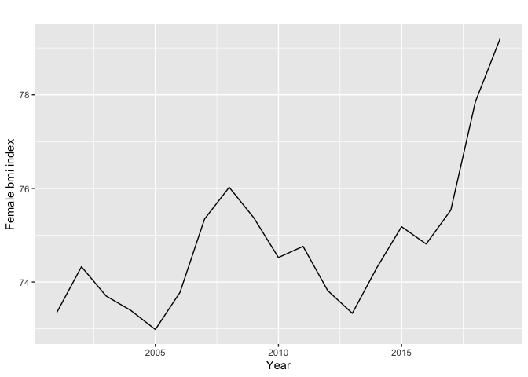

BR2211 Cancer Incidence Rate Prediction
================

## Part (a) Data Cleaning & Identifying Key Cancers for both Males & Females

### 1. Import dataset and necessary packages

make sure working directory is the BR2211 Cancer Incidence Data Folder

``` r
rm(list=ls())

# List of required packages
required_packages <- c("readxl", "tidyverse","torch", "luz" ,"tseries","forecast")

# Check if the required packages are installed
missing_packages <- required_packages[!requireNamespace(required_packages, quietly = TRUE)]

# Install missing packages if any
if (length(missing_packages) > 0) {
  install.packages(missing_packages)
}

library('readxl')
library('tidyverse')
```

    ## ── Attaching core tidyverse packages ──────────────────────── tidyverse 2.0.0 ──
    ## ✔ dplyr     1.1.4     ✔ readr     2.1.5
    ## ✔ forcats   1.0.0     ✔ stringr   1.5.0
    ## ✔ ggplot2   3.5.0     ✔ tibble    3.2.1
    ## ✔ lubridate 1.9.3     ✔ tidyr     1.3.1
    ## ✔ purrr     1.0.2     
    ## ── Conflicts ────────────────────────────────────────── tidyverse_conflicts() ──
    ## ✖ dplyr::filter() masks stats::filter()
    ## ✖ dplyr::lag()    masks stats::lag()
    ## ℹ Use the conflicted package (<http://conflicted.r-lib.org/>) to force all conflicts to become errors

``` r
library('forecast')
```

    ## Registered S3 method overwritten by 'quantmod':
    ##   method            from
    ##   as.zoo.data.frame zoo

``` r
library('tseries')
library('torch')
library('luz')
```

``` r
#Read excel
Cancer_Incidence <-read_excel("Cancer Incidence Data.xlsx")
```

    ## New names:
    ## • `` -> `...2`
    ## • `` -> `...3`
    ## • `` -> `...4`
    ## • `` -> `...5`
    ## • `` -> `...6`
    ## • `` -> `...7`
    ## • `` -> `...8`
    ## • `` -> `...9`
    ## • `` -> `...10`
    ## • `` -> `...11`
    ## • `` -> `...12`
    ## • `` -> `...13`

``` r
#Rename Columns
names(Cancer_Incidence) [1] <- "Data type"
names(Cancer_Incidence) [2] <- "Cancer group/site"
names(Cancer_Incidence) [3] <- "Year"
names(Cancer_Incidence) [4] <- "Sex"
names(Cancer_Incidence) [5] <- "Age group (years)"
names(Cancer_Incidence) [6] <- "Count"
names(Cancer_Incidence) [7] <- "Age-specific rate (per 100,000)"
names(Cancer_Incidence) [8] <- "Age-standardised rate + 2001 Australian Standard Population (per 100,000)"
names(Cancer_Incidence) [9] <- "Age-standardised rate + 2023 Australian Population"
names(Cancer_Incidence) [10] <- "Age-standardised rate (WHO) (per 100,000)"
names(Cancer_Incidence) [11] <- "Age-standardised rate (Segi) (per 100,000)"
names(Cancer_Incidence) [13] <- "ICD 10 codes"
```

### 2. Data Cleaning

#### 2.1 Remove irrelevant information

The following operations are conducted:

- Remove Rows 1 to 4 with NA values

- Remove Column 12 with NA values

- Convert data class of Year to numeric

- Remove all years before Year 2001 for simplicity

- Remove all projections

- Combine all age groups: Remove all age group except for ages combined

``` r
Cancer_Incidence2 <- Cancer_Incidence %>%
  slice(5:n()) %>%
  select(-"...12") %>%
  mutate(Year = as.numeric(as.character(Year))) %>%
  filter(Year > 2000) %>%
  filter(!str_detect(`Data type`, "Projections")) %>%
  filter(`Age group (years)` == "All ages combined")
```

#### 2.2 Get gender/non-gender specific cancer incidence rates

``` r
#Remove all sex groups and keep only males
Cancer_IncidenceMales <-Cancer_Incidence2%>%filter(`Sex`=='Males')%>%mutate(`Age-standardised rate (WHO) (per 100,000)`=as.numeric(as.character(`Age-standardised rate (WHO) (per 100,000)`)))
glimpse(Cancer_IncidenceMales)
```

    ## Rows: 1,702
    ## Columns: 12
    ## $ `Data type`                                                                 <chr> …
    ## $ `Cancer group/site`                                                         <chr> …
    ## $ Year                                                                        <dbl> …
    ## $ Sex                                                                         <chr> …
    ## $ `Age group (years)`                                                         <chr> …
    ## $ Count                                                                       <chr> …
    ## $ `Age-specific rate (per 100,000)`                                           <chr> …
    ## $ `Age-standardised rate + 2001 Australian Standard Population (per 100,000)` <chr> …
    ## $ `Age-standardised rate + 2023 Australian Population`                        <chr> …
    ## $ `Age-standardised rate (WHO) (per 100,000)`                                 <dbl> …
    ## $ `Age-standardised rate (Segi) (per 100,000)`                                <chr> …
    ## $ `ICD 10 codes`                                                              <chr> …

``` r
#Remove all sex groups and keep only females
Cancer_IncidenceFemales <-Cancer_Incidence2%>%filter(`Sex`=='Females')%>%mutate(`Age-standardised rate (WHO) (per 100,000)`=as.numeric(as.character(`Age-standardised rate (WHO) (per 100,000)`)))
glimpse(Cancer_IncidenceFemales)
```

    ## Rows: 1,807
    ## Columns: 12
    ## $ `Data type`                                                                 <chr> …
    ## $ `Cancer group/site`                                                         <chr> …
    ## $ Year                                                                        <dbl> …
    ## $ Sex                                                                         <chr> …
    ## $ `Age group (years)`                                                         <chr> …
    ## $ Count                                                                       <chr> …
    ## $ `Age-specific rate (per 100,000)`                                           <chr> …
    ## $ `Age-standardised rate + 2001 Australian Standard Population (per 100,000)` <chr> …
    ## $ `Age-standardised rate + 2023 Australian Population`                        <chr> …
    ## $ `Age-standardised rate (WHO) (per 100,000)`                                 <dbl> …
    ## $ `Age-standardised rate (Segi) (per 100,000)`                                <chr> …
    ## $ `ICD 10 codes`                                                              <chr> …

``` r
#Remove all sex groups and keep only persons
Cancer_IncidenceAll <-Cancer_Incidence2%>%filter(`Sex`=='Persons')%>%mutate(`Age-standardised rate (WHO) (per 100,000)`=as.numeric(as.character(`Age-standardised rate (WHO) (per 100,000)`)))
glimpse(Cancer_IncidenceAll)
```

    ## Rows: 1,883
    ## Columns: 12
    ## $ `Data type`                                                                 <chr> …
    ## $ `Cancer group/site`                                                         <chr> …
    ## $ Year                                                                        <dbl> …
    ## $ Sex                                                                         <chr> …
    ## $ `Age group (years)`                                                         <chr> …
    ## $ Count                                                                       <chr> …
    ## $ `Age-specific rate (per 100,000)`                                           <chr> …
    ## $ `Age-standardised rate + 2001 Australian Standard Population (per 100,000)` <chr> …
    ## $ `Age-standardised rate + 2023 Australian Population`                        <chr> …
    ## $ `Age-standardised rate (WHO) (per 100,000)`                                 <dbl> …
    ## $ `Age-standardised rate (Segi) (per 100,000)`                                <chr> …
    ## $ `ICD 10 codes`                                                              <chr> …

#### 2.3 Identify Key Cancers

Identify Key Cancers for Males

``` r
# Sum up the Age-standardised rate (WHO) (per 100,000) by types of cancer for males
Cancer_sumagestdMales <- Cancer_IncidenceMales %>%
  group_by(`Cancer group/site`) %>%
  summarise(sum = sum(`Age-standardised rate (WHO) (per 100,000)`)) %>%
  arrange(desc(sum))

head(Cancer_sumagestdMales,n=10)
```

    ## # A tibble: 10 × 2
    ##    `Cancer group/site`                               sum
    ##    <chr>                                           <dbl>
    ##  1 All cancers combined                            8036.
    ##  2 Prostate cancer                                 2217.
    ##  3 Colorectal cancer                                949.
    ##  4 Melanoma of the skin                             876.
    ##  5 All blood cancers combined                       837.
    ##  6 Lung cancer                                      737 
    ##  7 Colon cancer                                     585.
    ##  8 Head and neck cancer (including lip)             381.
    ##  9 Rectal cancer (including rectosigmoid junction)  365.
    ## 10 Lymphoma                                         363.

``` r
ggplot(head(Cancer_sumagestdMales, 10), aes(x = reorder(`Cancer group/site`, -sum), y = sum)) +
  geom_bar(stat = "identity", fill = "skyblue") +
  labs(title = "Top 10 Cancers for Males",
       x = "Cancer Group/Site",
       y = "Sum of ASR from 2001-2019") +
  theme(axis.text.x = element_text(angle = 45, hjust = 1))
```

<!-- -->

Identify Key Cancers for Females

``` r
# Sum up the Age-standardised rate (WHO) (per 100,000) by types of cancer for females
Cancer_sumagestdFemales <- Cancer_IncidenceFemales %>%
  group_by(`Cancer group/site`) %>%
  summarise(sum = sum(`Age-standardised rate (WHO) (per 100,000)`)) %>%
  arrange(desc(sum))

head(Cancer_sumagestdFemales,n=10)
```

    ## # A tibble: 10 × 2
    ##    `Cancer group/site`          sum
    ##    <chr>                      <dbl>
    ##  1 All cancers combined       6059.
    ##  2 Breast cancer              1803.
    ##  3 Colorectal cancer           685.
    ##  4 Melanoma of the skin        622.
    ##  5 Gynaecological cancers      594 
    ##  6 All blood cancers combined  556.
    ##  7 Colon cancer                484.
    ##  8 Lung cancer                 447.
    ##  9 Uterine cancer              261.
    ## 10 Lymphoma                    258.

``` r
ggplot(head(Cancer_sumagestdFemales, 10), aes(x = reorder(`Cancer group/site`, -sum), y = sum)) +
  geom_bar(stat = "identity", fill = "lightpink") +
  labs(title = "Top 10 Cancers for Females",
       x = "Cancer Group/Site",
       y = "Sum of ASR from 2001-2019") +
  theme(axis.text.x = element_text(angle = 45, hjust = 1))
```

<!-- -->

Identify Key Cancers for all Australians from 2001-2019

``` r
# Sum up the Age-standardised rate (WHO) (per 100,000) by types of cancer for persons
Cancer_sumagestdAll <- Cancer_IncidenceAll %>%
  group_by(`Cancer group/site`) %>%
  summarise(sum = sum(`Age-standardised rate (WHO) (per 100,000)`)) %>%
  arrange(desc(sum))
head(Cancer_sumagestdAll,n=10)
```

    ## # A tibble: 10 × 2
    ##    `Cancer group/site`          sum
    ##    <chr>                      <dbl>
    ##  1 All cancers combined       6964.
    ##  2 Prostate cancer            1058.
    ##  3 Breast cancer               930.
    ##  4 Colorectal cancer           810.
    ##  5 Melanoma of the skin        740 
    ##  6 All blood cancers combined  688.
    ##  7 Lung cancer                 580.
    ##  8 Colon cancer                531.
    ##  9 Lymphoma                    308.
    ## 10 Gynaecological cancers      306.

``` r
ggplot(head(Cancer_sumagestdAll, 10), aes(x = reorder(`Cancer group/site`, -sum), y = sum)) +
  geom_bar(stat = "identity", fill = "lightgreen") +
  labs(title = "Top 10 Cancers for All Persons",
       x = "Cancer Group/Site",
       y = "Sum of ASR from 2001-2019") +
  theme(axis.text.x = element_text(angle = 45, hjust = 1))
```

<!-- -->

## Part (b) Risk Factors

### 1. Non-gender specific cancers

#### 1.1 Colorectal cancer

``` r
###All Colorectal Cancer
# Load data for Colorectal Cancer
colorectal_data <- read_excel("RiskFactors.xlsx", sheet = "ColorectalCancer")

# Summarize the data for Colorectal Cancer
summary(colorectal_data)
```

    ##      Year           ColorectalCancer Inflammatory_bowel_disease
    ##  Length:19          Min.   :37.50    Min.   :0.8876            
    ##  Class :character   1st Qu.:40.20    1st Qu.:1.1311            
    ##  Mode  :character   Median :43.60    Median :1.3381            
    ##                     Mean   :42.64    Mean   :1.2814            
    ##                     3rd Qu.:45.00    3rd Qu.:1.4399            
    ##                     Max.   :46.90    Max.   :1.5001            
    ##     Tobacoo        Alcohol_use       Drug_use      High_bodymass_index
    ##  Min.   : 80.62   Min.   :32.55   Min.   : 8.407   Min.   :68.97      
    ##  1st Qu.: 82.81   1st Qu.:32.95   1st Qu.: 8.591   1st Qu.:70.06      
    ##  Median : 87.40   Median :33.59   Median : 8.703   Median :70.92      
    ##  Mean   : 90.66   Mean   :33.57   Mean   : 9.294   Mean   :71.17      
    ##  3rd Qu.: 95.87   3rd Qu.:33.98   3rd Qu.:10.190   3rd Qu.:71.67      
    ##  Max.   :110.62   Max.   :34.91   Max.   :10.881   Max.   :76.17      
    ##  High_systolic_blood_pressure High_LDL_cholesterol
    ##  Min.   : 96.00               Min.   :53.37       
    ##  1st Qu.: 98.29               1st Qu.:54.86       
    ##  Median :103.79               Median :58.56       
    ##  Mean   :107.71               Mean   :61.51       
    ##  3rd Qu.:112.25               3rd Qu.:65.38       
    ##  Max.   :134.00               Max.   :77.66

``` r
# Model the relationship for Colorectal Cancer
colorectal_model <- lm(ColorectalCancer ~ Inflammatory_bowel_disease + Tobacoo + Alcohol_use + Drug_use + High_bodymass_index + High_systolic_blood_pressure + High_LDL_cholesterol, data = colorectal_data)

# Summarize the regression model
summary(colorectal_model)
```

    ## 
    ## Call:
    ## lm(formula = ColorectalCancer ~ Inflammatory_bowel_disease + 
    ##     Tobacoo + Alcohol_use + Drug_use + High_bodymass_index + 
    ##     High_systolic_blood_pressure + High_LDL_cholesterol, data = colorectal_data)
    ## 
    ## Residuals:
    ##     Min      1Q  Median      3Q     Max 
    ## -0.6685 -0.4362 -0.2721  0.4208  1.3655 
    ## 
    ## Coefficients:
    ##                              Estimate Std. Error t value Pr(>|t|)  
    ## (Intercept)                    8.9080    26.2970   0.339   0.7412  
    ## Inflammatory_bowel_disease    34.5578    11.7092   2.951   0.0132 *
    ## Tobacoo                        1.0333     0.4688   2.204   0.0497 *
    ## Alcohol_use                   -1.9342     1.2053  -1.605   0.1369  
    ## Drug_use                       1.2303     1.4199   0.866   0.4047  
    ## High_bodymass_index           -0.3930     0.6087  -0.646   0.5318  
    ## High_systolic_blood_pressure  -0.8445     0.4460  -1.893   0.0849 .
    ## High_LDL_cholesterol           1.1087     0.9879   1.122   0.2856  
    ## ---
    ## Signif. codes:  0 '***' 0.001 '**' 0.01 '*' 0.05 '.' 0.1 ' ' 1
    ## 
    ## Residual standard error: 0.6986 on 11 degrees of freedom
    ## Multiple R-squared:  0.9673, Adjusted R-squared:  0.9465 
    ## F-statistic: 46.47 on 7 and 11 DF,  p-value: 2.661e-07

``` r
# Perform stepwise regression using AIC
colorectal_stepwise_model <- MASS::stepAIC(colorectal_model, direction = "both")
```

    ## Start:  AIC=-8.01
    ## ColorectalCancer ~ Inflammatory_bowel_disease + Tobacoo + Alcohol_use + 
    ##     Drug_use + High_bodymass_index + High_systolic_blood_pressure + 
    ##     High_LDL_cholesterol
    ## 
    ##                                Df Sum of Sq    RSS     AIC
    ## - High_bodymass_index           1    0.2034 5.5720 -9.3071
    ## - Drug_use                      1    0.3664 5.7350 -8.7592
    ## <none>                                      5.3685 -8.0137
    ## - High_LDL_cholesterol          1    0.6147 5.9833 -7.9540
    ## - Alcohol_use                   1    1.2568 6.6254 -6.0171
    ## - High_systolic_blood_pressure  1    1.7495 7.1180 -4.6544
    ## - Tobacoo                       1    2.3713 7.7399 -3.0630
    ## - Inflammatory_bowel_disease    1    4.2511 9.6197  1.0681
    ## 
    ## Step:  AIC=-9.31
    ## ColorectalCancer ~ Inflammatory_bowel_disease + Tobacoo + Alcohol_use + 
    ##     Drug_use + High_systolic_blood_pressure + High_LDL_cholesterol
    ## 
    ##                                Df Sum of Sq     RSS      AIC
    ## - Drug_use                      1    0.2251  5.7971 -10.5547
    ## - High_LDL_cholesterol          1    0.4333  6.0053  -9.8842
    ## <none>                                       5.5720  -9.3071
    ## + High_bodymass_index           1    0.2034  5.3685  -8.0137
    ## - High_systolic_blood_pressure  1    1.6508  7.2228  -6.3768
    ## - Alcohol_use                   1    2.2900  7.8620  -4.7657
    ## - Inflammatory_bowel_disease    1    4.5024 10.0743  -0.0545
    ## - Tobacoo                       1    7.1617 12.7336   4.3963
    ## 
    ## Step:  AIC=-10.55
    ## ColorectalCancer ~ Inflammatory_bowel_disease + Tobacoo + Alcohol_use + 
    ##     High_systolic_blood_pressure + High_LDL_cholesterol
    ## 
    ##                                Df Sum of Sq     RSS      AIC
    ## - High_LDL_cholesterol          1    0.2133  6.0103 -11.8683
    ## <none>                                       5.7971 -10.5547
    ## + Drug_use                      1    0.2251  5.5720  -9.3071
    ## + High_bodymass_index           1    0.0621  5.7350  -8.7592
    ## - Alcohol_use                   1    2.1041  7.9012  -6.6711
    ## - Inflammatory_bowel_disease    1    4.3349 10.1319  -1.9462
    ## - High_systolic_blood_pressure  1    4.3458 10.1429  -1.9257
    ## - Tobacoo                       1    7.6785 13.4755   3.4723
    ## 
    ## Step:  AIC=-11.87
    ## ColorectalCancer ~ Inflammatory_bowel_disease + Tobacoo + Alcohol_use + 
    ##     High_systolic_blood_pressure
    ## 
    ##                                Df Sum of Sq    RSS      AIC
    ## <none>                                       6.010 -11.8683
    ## + High_LDL_cholesterol          1     0.213  5.797 -10.5547
    ## + High_bodymass_index           1     0.027  5.983  -9.9540
    ## + Drug_use                      1     0.005  6.005  -9.8842
    ## - Alcohol_use                   1     4.376 10.387  -3.4747
    ## - Inflammatory_bowel_disease    1     9.586 15.596   4.2489
    ## - High_systolic_blood_pressure  1    13.804 19.814   8.7973
    ## - Tobacoo                       1    36.470 42.480  23.2873

``` r
# Summarize the stepwise regression model
summary(colorectal_stepwise_model)
```

    ## 
    ## Call:
    ## lm(formula = ColorectalCancer ~ Inflammatory_bowel_disease + 
    ##     Tobacoo + Alcohol_use + High_systolic_blood_pressure, data = colorectal_data)
    ## 
    ## Residuals:
    ##      Min       1Q   Median       3Q      Max 
    ## -0.71302 -0.51618  0.08607  0.41066  1.40654 
    ## 
    ## Coefficients:
    ##                              Estimate Std. Error t value Pr(>|t|)    
    ## (Intercept)                  12.71897   22.05132   0.577 0.573240    
    ## Inflammatory_bowel_disease   34.26267    7.25094   4.725 0.000325 ***
    ## Tobacoo                       1.31087    0.14223   9.217 2.54e-07 ***
    ## Alcohol_use                  -2.56336    0.80287  -3.193 0.006514 ** 
    ## High_systolic_blood_pressure -0.43419    0.07657  -5.670 5.78e-05 ***
    ## ---
    ## Signif. codes:  0 '***' 0.001 '**' 0.01 '*' 0.05 '.' 0.1 ' ' 1
    ## 
    ## Residual standard error: 0.6552 on 14 degrees of freedom
    ## Multiple R-squared:  0.9634, Adjusted R-squared:  0.9529 
    ## F-statistic: 92.08 on 4 and 14 DF,  p-value: 6.839e-10

``` r
######## Try run in terminals! ########

# Plot diagnostic plots for the final linear model
par(mfrow = c(2, 2))
plot(colorectal_stepwise_model)
```

<!-- -->

#### 1.1 Melanoma cancer

``` r
###All Melanoma of the skin 
# Load data for Melanoma of the skin
melanoma_data <- read_excel("RiskFactors.xlsx", sheet = "MekanomaCancer")

# Summarize the data for Melanoma of the skin
summary(melanoma_data)
```

    ##      Year           MekanomaCancer     High_temperature
    ##  Length:19          Length:19          Min.   :4.037   
    ##  Class :character   Class :character   1st Qu.:4.724   
    ##  Mode  :character   Mode  :character   Median :4.956   
    ##                                        Mean   :4.917   
    ##                                        3rd Qu.:5.112   
    ##                                        Max.   :5.933

``` r
# Model the relationship for Melanoma of the skin
melanoma_model <- lm(MekanomaCancer ~ High_temperature, data = melanoma_data)

# Summarize the regression model
summary(melanoma_model)
```

    ## 
    ## Call:
    ## lm(formula = MekanomaCancer ~ High_temperature, data = melanoma_data)
    ## 
    ## Residuals:
    ##      Min       1Q   Median       3Q      Max 
    ## -1.87358 -0.74495  0.05326  0.40945  2.44340 
    ## 
    ## Coefficients:
    ##                  Estimate Std. Error t value Pr(>|t|)    
    ## (Intercept)        30.135      3.478   8.665 1.21e-07 ***
    ## High_temperature    1.792      0.705   2.542    0.021 *  
    ## ---
    ## Signif. codes:  0 '***' 0.001 '**' 0.01 '*' 0.05 '.' 0.1 ' ' 1
    ## 
    ## Residual standard error: 1.234 on 17 degrees of freedom
    ## Multiple R-squared:  0.2754, Adjusted R-squared:  0.2328 
    ## F-statistic: 6.463 on 1 and 17 DF,  p-value: 0.02105

``` r
# Perform stepwise regression using AIC
melanoma_stepwise_model <- MASS::stepAIC(melanoma_model, direction = "both")
```

    ## Start:  AIC=9.87
    ## MekanomaCancer ~ High_temperature
    ## 
    ##                    Df Sum of Sq    RSS     AIC
    ## <none>                          25.872  9.8656
    ## - High_temperature  1    9.8355 35.707 13.9874

``` r
# Summarize the stepwise regression model
summary(melanoma_stepwise_model)
```

    ## 
    ## Call:
    ## lm(formula = MekanomaCancer ~ High_temperature, data = melanoma_data)
    ## 
    ## Residuals:
    ##      Min       1Q   Median       3Q      Max 
    ## -1.87358 -0.74495  0.05326  0.40945  2.44340 
    ## 
    ## Coefficients:
    ##                  Estimate Std. Error t value Pr(>|t|)    
    ## (Intercept)        30.135      3.478   8.665 1.21e-07 ***
    ## High_temperature    1.792      0.705   2.542    0.021 *  
    ## ---
    ## Signif. codes:  0 '***' 0.001 '**' 0.01 '*' 0.05 '.' 0.1 ' ' 1
    ## 
    ## Residual standard error: 1.234 on 17 degrees of freedom
    ## Multiple R-squared:  0.2754, Adjusted R-squared:  0.2328 
    ## F-statistic: 6.463 on 1 and 17 DF,  p-value: 0.02105

``` r
# Plot diagnostic plots for the final linear model
par(mfrow = c(2, 2))
plot(melanoma_stepwise_model)
```

<!-- -->

### 2. Male cancers (prostate)

``` r
# Load data for Male Prostate Cancer
prostate_data <- read_excel("RiskFactors.xlsx", sheet = "ProstateCancer")

# Summarize the data for Male Prostate Cancer
summary(prostate_data)
```

    ##      Year           ProstateCancer     Ethnicity_SouthAfrica    Tobacoo      
    ##  Length:19          Length:19          Min.   :43170         Min.   : 94.15  
    ##  Class :character   Class :character   1st Qu.:58364         1st Qu.: 97.47  
    ##  Mode  :character   Mode  :character   Median :77936         Median :105.33  
    ##                                        Mean   :73436         Mean   :108.76  
    ##                                        3rd Qu.:87548         3rd Qu.:116.44  
    ##                                        Max.   :96285         Max.   :136.74  
    ##   Alcohol_use       Drug_use     High_bodymass_index
    ##  Min.   :51.67   Min.   :11.65   Min.   :64.46      
    ##  1st Qu.:52.32   1st Qu.:11.88   1st Qu.:65.79      
    ##  Median :52.65   Median :12.11   Median :66.93      
    ##  Mean   :52.68   Mean   :12.60   Mean   :67.44      
    ##  3rd Qu.:52.86   3rd Qu.:13.60   3rd Qu.:69.10      
    ##  Max.   :54.41   Max.   :14.18   Max.   :73.06

``` r
# Model the relationship for Male Prostate Cancer
prostate_model <- lm(ProstateCancer ~ Ethnicity_SouthAfrica + Tobacoo + Alcohol_use + Drug_use + High_bodymass_index, data = prostate_data)

# Summarize the regression model
summary(prostate_model)
```

    ## 
    ## Call:
    ## lm(formula = ProstateCancer ~ Ethnicity_SouthAfrica + Tobacoo + 
    ##     Alcohol_use + Drug_use + High_bodymass_index, data = prostate_data)
    ## 
    ## Residuals:
    ##      Min       1Q   Median       3Q      Max 
    ## -11.7384  -2.4914   0.6429   3.6693   7.5448 
    ## 
    ## Coefficients:
    ##                         Estimate Std. Error t value Pr(>|t|)    
    ## (Intercept)            4.572e+02  1.890e+02   2.419 0.030952 *  
    ## Ethnicity_SouthAfrica -2.144e-03  7.676e-04  -2.793 0.015221 *  
    ## Tobacoo               -4.222e+00  9.793e-01  -4.311 0.000846 ***
    ## Alcohol_use            7.183e+00  5.426e+00   1.324 0.208334    
    ## Drug_use              -2.925e+01  3.602e+00  -8.120  1.9e-06 ***
    ## High_bodymass_index    3.946e+00  1.423e+00   2.772 0.015843 *  
    ## ---
    ## Signif. codes:  0 '***' 0.001 '**' 0.01 '*' 0.05 '.' 0.1 ' ' 1
    ## 
    ## Residual standard error: 6.107 on 13 degrees of freedom
    ## Multiple R-squared:  0.8797, Adjusted R-squared:  0.8334 
    ## F-statistic: 19.01 on 5 and 13 DF,  p-value: 1.446e-05

``` r
# Perform stepwise regression using AIC
prostate_stepwise_model <- MASS::stepAIC(prostate_model, direction = "both")
```

    ## Start:  AIC=73.55
    ## ProstateCancer ~ Ethnicity_SouthAfrica + Tobacoo + Alcohol_use + 
    ##     Drug_use + High_bodymass_index
    ## 
    ##                         Df Sum of Sq     RSS     AIC
    ## <none>                                484.87  73.549
    ## - Alcohol_use            1     65.38  550.25  73.953
    ## - High_bodymass_index    1    286.69  771.56  80.376
    ## - Ethnicity_SouthAfrica  1    291.03  775.91  80.482
    ## - Tobacoo                1    693.06 1177.94  88.415
    ## - Drug_use               1   2459.35 2944.22 105.820

``` r
# Summarize the stepwise regression model
summary(prostate_stepwise_model)
```

    ## 
    ## Call:
    ## lm(formula = ProstateCancer ~ Ethnicity_SouthAfrica + Tobacoo + 
    ##     Alcohol_use + Drug_use + High_bodymass_index, data = prostate_data)
    ## 
    ## Residuals:
    ##      Min       1Q   Median       3Q      Max 
    ## -11.7384  -2.4914   0.6429   3.6693   7.5448 
    ## 
    ## Coefficients:
    ##                         Estimate Std. Error t value Pr(>|t|)    
    ## (Intercept)            4.572e+02  1.890e+02   2.419 0.030952 *  
    ## Ethnicity_SouthAfrica -2.144e-03  7.676e-04  -2.793 0.015221 *  
    ## Tobacoo               -4.222e+00  9.793e-01  -4.311 0.000846 ***
    ## Alcohol_use            7.183e+00  5.426e+00   1.324 0.208334    
    ## Drug_use              -2.925e+01  3.602e+00  -8.120  1.9e-06 ***
    ## High_bodymass_index    3.946e+00  1.423e+00   2.772 0.015843 *  
    ## ---
    ## Signif. codes:  0 '***' 0.001 '**' 0.01 '*' 0.05 '.' 0.1 ' ' 1
    ## 
    ## Residual standard error: 6.107 on 13 degrees of freedom
    ## Multiple R-squared:  0.8797, Adjusted R-squared:  0.8334 
    ## F-statistic: 19.01 on 5 and 13 DF,  p-value: 1.446e-05

``` r
# Plot diagnostic plots for the final linear model
par(mfrow = c(2, 2))
plot(prostate_stepwise_model)
```

<!-- -->

``` r
```

### 

### 3. Female cancers (breast)

``` r
# Load data for Female Breast Cancer
breast_data <- read_excel("RiskFactors.xlsx", sheet = "BreastCancer")

# Summarize the data for Female Breast Cancer
summary(breast_data)
```

    ##      Year           BreastCancer       Low_physical_activity    Tobacoo     
    ##  Length:19          Length:19          Min.   :18.70         Min.   :67.41  
    ##  Class :character   Class :character   1st Qu.:19.59         1st Qu.:68.63  
    ##  Mode  :character   Mode  :character   Median :22.05         Median :69.83  
    ##                                        Mean   :21.78         Mean   :72.97  
    ##                                        3rd Qu.:23.39         3rd Qu.:75.76  
    ##                                        Max.   :24.97         Max.   :85.08  
    ##   Alcohol_use       Drug_use     High_bodymass_index
    ##  Min.   :13.02   Min.   :4.914   Min.   :72.99      
    ##  1st Qu.:14.20   1st Qu.:5.383   1st Qu.:73.74      
    ##  Median :15.12   Median :5.673   Median :74.52      
    ##  Mean   :14.89   Mean   :6.065   Mean   :74.82      
    ##  3rd Qu.:15.61   3rd Qu.:6.851   3rd Qu.:75.36      
    ##  Max.   :15.91   Max.   :7.663   Max.   :79.20

``` r
# Model the relationship for Female Breast Cancer
breast_model <- lm(BreastCancer ~ Low_physical_activity + Tobacoo + Alcohol_use + Drug_use + High_bodymass_index, data = breast_data)

# Summarize the regression model
summary(breast_model)
```

    ## 
    ## Call:
    ## lm(formula = BreastCancer ~ Low_physical_activity + Tobacoo + 
    ##     Alcohol_use + Drug_use + High_bodymass_index, data = breast_data)
    ## 
    ## Residuals:
    ##     Min      1Q  Median      3Q     Max 
    ## -3.0125 -0.6575  0.1198  0.8420  1.9613 
    ## 
    ## Coefficients:
    ##                       Estimate Std. Error t value Pr(>|t|)   
    ## (Intercept)            64.9570    45.9533   1.414  0.18099   
    ## Low_physical_activity  -7.9195     2.0752  -3.816  0.00214 **
    ## Tobacoo                 0.9851     0.2918   3.376  0.00496 **
    ## Alcohol_use            -2.0863     2.6561  -0.785  0.44625   
    ## Drug_use              -10.6769     4.1924  -2.547  0.02434 * 
    ## High_bodymass_index     3.0248     1.1361   2.663  0.01954 * 
    ## ---
    ## Signif. codes:  0 '***' 0.001 '**' 0.01 '*' 0.05 '.' 0.1 ' ' 1
    ## 
    ## Residual standard error: 1.476 on 13 degrees of freedom
    ## Multiple R-squared:  0.9022, Adjusted R-squared:  0.8646 
    ## F-statistic: 23.98 on 5 and 13 DF,  p-value: 3.889e-06

``` r
# Perform stepwise regression using AIC
breast_stepwise_model <- MASS::stepAIC(breast_model, direction = "both")
```

    ## Start:  AIC=19.57
    ## BreastCancer ~ Low_physical_activity + Tobacoo + Alcohol_use + 
    ##     Drug_use + High_bodymass_index
    ## 
    ##                         Df Sum of Sq    RSS    AIC
    ## - Alcohol_use            1     1.343 29.649 18.455
    ## <none>                               28.306 19.574
    ## - Drug_use               1    14.122 42.427 25.264
    ## - High_bodymass_index    1    15.435 43.741 25.843
    ## - Tobacoo                1    24.819 53.124 29.536
    ## - Low_physical_activity  1    31.711 60.017 31.854
    ## 
    ## Step:  AIC=18.45
    ## BreastCancer ~ Low_physical_activity + Tobacoo + Drug_use + High_bodymass_index
    ## 
    ##                         Df Sum of Sq    RSS    AIC
    ## <none>                               29.649 18.455
    ## + Alcohol_use            1     1.343 28.306 19.574
    ## - Drug_use               1    13.770 43.419 23.703
    ## - High_bodymass_index    1    17.606 47.255 25.311
    ## - Low_physical_activity  1    38.250 67.899 32.198
    ## - Tobacoo                1    43.372 73.021 33.580

``` r
# Summarize the stepwise regression model
summary(breast_stepwise_model)
```

    ## 
    ## Call:
    ## lm(formula = BreastCancer ~ Low_physical_activity + Tobacoo + 
    ##     Drug_use + High_bodymass_index, data = breast_data)
    ## 
    ## Residuals:
    ##     Min      1Q  Median      3Q     Max 
    ## -3.0057 -0.4960 -0.1263  1.0198  1.9132 
    ## 
    ## Coefficients:
    ##                       Estimate Std. Error t value Pr(>|t|)    
    ## (Intercept)            36.7652    28.3020   1.299 0.214920    
    ## Low_physical_activity  -6.9360     1.6320  -4.250 0.000808 ***
    ## Tobacoo                 1.1061     0.2444   4.525 0.000475 ***
    ## Drug_use               -8.9225     3.4991  -2.550 0.023119 *  
    ## High_bodymass_index     2.4400     0.8463   2.883 0.012033 *  
    ## ---
    ## Signif. codes:  0 '***' 0.001 '**' 0.01 '*' 0.05 '.' 0.1 ' ' 1
    ## 
    ## Residual standard error: 1.455 on 14 degrees of freedom
    ## Multiple R-squared:  0.8975, Adjusted R-squared:  0.8683 
    ## F-statistic: 30.66 on 4 and 14 DF,  p-value: 8.635e-07

``` r
# Plot diagnostic plots for the final linear model
par(mfrow = c(2, 2))
plot(breast_stepwise_model)
```

<!-- -->

``` r
# Check for multicollinearity using VIF
breast_vif_values <- car::vif(breast_stepwise_model)
breast_vif_values
```

    ## Low_physical_activity               Tobacoo              Drug_use 
    ##             108.14084              16.80362              85.87606 
    ##   High_bodymass_index 
    ##              15.12990

``` r
# Check correlation
cor(breast_data$Low_physical_activity, breast_data$High_bodymass_index)
```

    ## [1] -0.3826972

``` r
cor(breast_data$Low_physical_activity, breast_data$Alcohol_use)
```

    ## [1] -0.916064

## Part (c) Time Series Analysis

### 1. Female Breast Cancer

#### 1.1 Data Cleaning & Exploratory

``` r
Cancer_fem_brecancer1 <-read_excel("FemBreast.xlsx")
```

    ## New names:
    ## • `` -> `...15`
    ## • `` -> `...16`
    ## • `` -> `...17`
    ## • `` -> `...18`
    ## • `` -> `...19`
    ## • `` -> `...20`
    ## • `` -> `...21`
    ## • `` -> `...22`

``` r
head(Cancer_fem_brecancer1,19)
```

    ## # A tibble: 19 × 22
    ##    `Data type` `Cancer group/site`  Year Sex     `Age group (years)` Count 
    ##    <chr>       <chr>               <dbl> <chr>   <chr>               <chr> 
    ##  1 Actual      Breast cancer        2001 Females All ages combined   11,827
    ##  2 Actual      Breast cancer        2002 Females All ages combined   12,090
    ##  3 Actual      Breast cancer        2003 Females All ages combined   11,870
    ##  4 Actual      Breast cancer        2004 Females All ages combined   12,219
    ##  5 Actual      Breast cancer        2005 Females All ages combined   12,280
    ##  6 Actual      Breast cancer        2006 Females All ages combined   12,719
    ##  7 Actual      Breast cancer        2007 Females All ages combined   12,658
    ##  8 Actual      Breast cancer        2008 Females All ages combined   13,666
    ##  9 Actual      Breast cancer        2009 Females All ages combined   13,793
    ## 10 Actual      Breast cancer        2010 Females All ages combined   14,393
    ## 11 Actual      Breast cancer        2011 Females All ages combined   14,571
    ## 12 Actual      Breast cancer        2012 Females All ages combined   15,342
    ## 13 Actual      Breast cancer        2013 Females All ages combined   16,414
    ## 14 Actual      Breast cancer        2014 Females All ages combined   16,959
    ## 15 Actual      Breast cancer        2015 Females All ages combined   16,955
    ## 16 Actual      Breast cancer        2016 Females All ages combined   17,416
    ## 17 Actual      Breast cancer        2017 Females All ages combined   17,747
    ## 18 Actual      Breast cancer        2018 Females All ages combined   18,209
    ## 19 Actual      Breast cancer        2019 Females All ages combined   18,496
    ## # ℹ 16 more variables: `Age-specific rate (per 100,000)` <chr>,
    ## #   `Age-standardised rate + 2001 Australian Standard Population (per 100,000)` <chr>,
    ## #   `Age-standardised rate + 2023 Australian Population` <chr>,
    ## #   `Age-standardised rate (WHO) (per 100,000)` <chr>,
    ## #   `Age-standardised rate (Segi) (per 100,000)` <chr>, X.11 <lgl>,
    ## #   `ICD 10 codes` <chr>, `Overweight and Obese rate` <dbl>, ...15 <lgl>,
    ## #   ...16 <chr>, ...17 <lgl>, ...18 <lgl>, ...19 <lgl>, ...20 <lgl>, …

``` r
Cancer_fem_brecancer1 <- Cancer_fem_brecancer1 %>%
  select(Year, `Age-standardised rate (WHO) (per 100,000)`, `Overweight and Obese rate`) %>%
  mutate(`Age-standardised rate (WHO) (per 100,000)` = as.numeric(`Age-standardised rate (WHO) (per 100,000)`))

glimpse(Cancer_fem_brecancer1)
```

    ## Rows: 19
    ## Columns: 3
    ## $ Year                                        <dbl> 2001, 2002, 2003, 2004, 20…
    ## $ `Age-standardised rate (WHO) (per 100,000)` <dbl> 94.0, 94.2, 90.3, 91.0, 89…
    ## $ `Overweight and Obese rate`                 <dbl> 53.6, 53.9, 53.9, 54.1, 54…

``` r
ggplot(Cancer_fem_brecancer1, aes(x = Year, y = `Age-standardised rate (WHO) (per 100,000)`)) +
  geom_line() +
  labs(title = "Time Series Plot of Female Breast Cancer ASR",
       x = "Year",
       y = "Age-Standardized Rate (WHO) per 100,000") +
  theme_minimal()
```

<!-- -->

#### 1.2 Model Selection/Training

##### 1.2.1 LSTM

###### 1.2.1.1 Data preprocessing and train-test split

``` r
# Standardization (z-score normalization) to converge faster
Cancer_fem_brecancer1$ASR_scaled <- scale(Cancer_fem_brecancer1$`Age-standardised rate (WHO) (per 100,000)`)

original_mu = mean(Cancer_fem_brecancer1$`Age-standardised rate (WHO) (per 100,000)`)
original_sd =sd(Cancer_fem_brecancer1$`Age-standardised rate (WHO) (per 100,000)`)
```

``` r
#hyperparams
#window_size '*' windown_size < 19 !!!!!(2001-2019)
window_size <- 12

#batch_size '*' 2,4,8,16
batch_size <- 4

#hidden_size '*' 
hidden_size <- 64
```

``` r
# Following the convention, we adopt a 7:3 train test split 
# Define the proportion of data to use for training
train_frac <- 0.7

# Calculate the index to split the data
split_index <- floor(train_frac * (nrow(Cancer_fem_brecancer1)-window_size))+window_size

# Split the data into training and testing sets
train_data <- Cancer_fem_brecancer1[1:split_index, ]
test_data <- Cancer_fem_brecancer1[(split_index + 1):nrow(Cancer_fem_brecancer1), ]

train_data <- train_data$ASR_scaled%>% as.matrix()
test_data <- test_data$ASR_scaled%>% as.matrix()
scaled_data<- Cancer_fem_brecancer1$ASR_scaled%>%as.matrix()
```

###### 1.2.1.2 Define datasets and dataloaders

``` r
# Define the dataset
cancer_ts_dataset <- dataset(
  name = "my_dataset",
  
  initialize = function(data, window_size, sample_frac = 1) {
    self$window_size <- window_size
    self$data <- torch_tensor(data)
    
    n <- length(self$data) - self$window_size
    
    self$starts <- sort(sample.int(
      n = n,
      size = n * sample_frac
    ))
  },
  
  .getitem = function(i) {
    start <- self$starts[i]
    end <- start + self$window_size - 1
    
    list(
      x = self$data[start:end],
      y = self$data[end + 1]
    )
  },
  
  .length = function() {
    length(self$starts)
  }
)

cancer_ts_eval_dataset <- dataset(
  name = "my_eval_dataset",
  
  initialize = function(data, window_size, sample_frac = 1) {
    self$window_size <- window_size
    self$data <- torch_tensor(data)
    
    n <- 1
    
    self$starts <- sort(sample.int(
      n = n,
      size = n * sample_frac
    ))
  },
  
  .getitem = function(i) {
    start <- self$starts[i]
    end <- start + self$window_size - 1
    
    list(
      x = self$data[start:end],
      y = self$data[start]
    )
  },
  
  .length = function() {
    length(self$starts)
  }
)


train_dataset <- cancer_ts_dataset(train_data, window_size = window_size, sample_frac = 1)


# Define the dataloader
train_dl <- train_dataset %>% dataloader(batch_size = batch_size, shuffle = TRUE)

# Check the shape
#length(train_dl)
#b <- train_dl %>% dataloader_make_iter() %>% dataloader_next()
#b
```

###### 1.2.1.3 Construct LSTM network

``` r
# Define the TimeSeriesPredictor class
TimeSeriesPredictor <- nn_module(
  initialize = function(input_dim = 1, hidden_dim = 200, output_dim = 1, num_layers = 1, dropout = 0.2, rec_dropout = 0) {
    self$num_layers <- num_layers
    
    self$lstm <- nn_lstm(
      input_size = input_dim,
      hidden_size = hidden_dim,
      num_layers = num_layers,
      dropout = rec_dropout,
      batch_first = TRUE
    )
    
    self$dropout <- nn_dropout(dropout)
    self$fc1 <- nn_linear(hidden_dim, 100)
    self$fc2 <- nn_linear(100, output_dim)
  },
  forward = function(x) {
    (x %>%
       self$lstm())[[1]][, dim(x)[2], ] %>%
      #self$dropout() %>%
      self$fc1() %>%
      torch_relu() %>%
      self$fc2()
  }
)
```

###### 1.2.1.4 Training

``` r
torch_manual_seed(123)

net <- TimeSeriesPredictor %>%
  setup(optimizer = optim_adam, loss = nn_mse_loss())%>%
  set_hparams(
    input_dim = 1,
    hidden_dim = hidden_size,
    rec_dropout = 0
  )


# Use learning rate finder
rates_and_losses <- net %>% 
  lr_finder(train_dl, start_lr = 1e-3, end_lr = 1)

# Plot the results
rates_and_losses %>% plot()
```

<!-- -->

``` r
# It seems that lr =0.01 is a good choice

# Define the number of epochs '*'
epochs <- 100

# Fit the model
fitted <- net %>%
  set_opt_hparams(lr = 0.01) %>%
  fit(train_dl, 
      epochs = epochs, 
      verbose = TRUE)
```

    ## Epoch 1/100
    ## Train metrics: Loss: 1.5045
    ## Epoch 2/100
    ## Train metrics: Loss: 1.1366
    ## Epoch 3/100
    ## Train metrics: Loss: 0.7196
    ## Epoch 4/100
    ## Train metrics: Loss: 0.1739
    ## Epoch 5/100
    ## Train metrics: Loss: 0.8966
    ## Epoch 6/100
    ## Train metrics: Loss: 0.0799
    ## Epoch 7/100
    ## Train metrics: Loss: 0.0887
    ## Epoch 8/100
    ## Train metrics: Loss: 0.1922
    ## Epoch 9/100
    ## Train metrics: Loss: 0.2471
    ## Epoch 10/100
    ## Train metrics: Loss: 0.2541
    ## Epoch 11/100
    ## Train metrics: Loss: 0.2281
    ## Epoch 12/100
    ## Train metrics: Loss: 0.1826
    ## Epoch 13/100
    ## Train metrics: Loss: 0.13
    ## Epoch 14/100
    ## Train metrics: Loss: 0.0832
    ## Epoch 15/100
    ## Train metrics: Loss: 0.0546
    ## Epoch 16/100
    ## Train metrics: Loss: 0.0539
    ## Epoch 17/100
    ## Train metrics: Loss: 0.0775
    ## Epoch 18/100
    ## Train metrics: Loss: 0.1019
    ## Epoch 19/100
    ## Train metrics: Loss: 0.1043
    ## Epoch 20/100
    ## Train metrics: Loss: 0.0852
    ## Epoch 21/100
    ## Train metrics: Loss: 0.0603
    ## Epoch 22/100
    ## Train metrics: Loss: 0.0424
    ## Epoch 23/100
    ## Train metrics: Loss: 0.0353
    ## Epoch 24/100
    ## Train metrics: Loss: 0.0365
    ## Epoch 25/100
    ## Train metrics: Loss: 0.0416
    ## Epoch 26/100
    ## Train metrics: Loss: 0.0466
    ## Epoch 27/100
    ## Train metrics: Loss: 0.0489
    ## Epoch 28/100
    ## Train metrics: Loss: 0.0477
    ## Epoch 29/100
    ## Train metrics: Loss: 0.0432
    ## Epoch 30/100
    ## Train metrics: Loss: 0.0369
    ## Epoch 31/100
    ## Train metrics: Loss: 0.0304
    ## Epoch 32/100
    ## Train metrics: Loss: 0.0257
    ## Epoch 33/100
    ## Train metrics: Loss: 0.0238
    ## Epoch 34/100
    ## Train metrics: Loss: 0.0246
    ## Epoch 35/100
    ## Train metrics: Loss: 0.0272
    ## Epoch 36/100
    ## Train metrics: Loss: 0.0294
    ## Epoch 37/100
    ## Train metrics: Loss: 0.0298
    ## Epoch 38/100
    ## Train metrics: Loss: 0.028
    ## Epoch 39/100
    ## Train metrics: Loss: 0.025
    ## Epoch 40/100
    ## Train metrics: Loss: 0.0223
    ## Epoch 41/100
    ## Train metrics: Loss: 0.0209
    ## Epoch 42/100
    ## Train metrics: Loss: 0.0209
    ## Epoch 43/100
    ## Train metrics: Loss: 0.022
    ## Epoch 44/100
    ## Train metrics: Loss: 0.0233
    ## Epoch 45/100
    ## Train metrics: Loss: 0.024
    ## Epoch 46/100
    ## Train metrics: Loss: 0.0238
    ## Epoch 47/100
    ## Train metrics: Loss: 0.023
    ## Epoch 48/100
    ## Train metrics: Loss: 0.0218
    ## Epoch 49/100
    ## Train metrics: Loss: 0.0209
    ## Epoch 50/100
    ## Train metrics: Loss: 0.0206
    ## Epoch 51/100
    ## Train metrics: Loss: 0.0209
    ## Epoch 52/100
    ## Train metrics: Loss: 0.0215
    ## Epoch 53/100
    ## Train metrics: Loss: 0.022
    ## Epoch 54/100
    ## Train metrics: Loss: 0.0221
    ## Epoch 55/100
    ## Train metrics: Loss: 0.0217
    ## Epoch 56/100
    ## Train metrics: Loss: 0.0211
    ## Epoch 57/100
    ## Train metrics: Loss: 0.0206
    ## Epoch 58/100
    ## Train metrics: Loss: 0.0204
    ## Epoch 59/100
    ## Train metrics: Loss: 0.0205
    ## Epoch 60/100
    ## Train metrics: Loss: 0.0208
    ## Epoch 61/100
    ## Train metrics: Loss: 0.0209
    ## Epoch 62/100
    ## Train metrics: Loss: 0.0209
    ## Epoch 63/100
    ## Train metrics: Loss: 0.0207
    ## Epoch 64/100
    ## Train metrics: Loss: 0.0204
    ## Epoch 65/100
    ## Train metrics: Loss: 0.0202
    ## Epoch 66/100
    ## Train metrics: Loss: 0.0201
    ## Epoch 67/100
    ## Train metrics: Loss: 0.0201
    ## Epoch 68/100
    ## Train metrics: Loss: 0.0202
    ## Epoch 69/100
    ## Train metrics: Loss: 0.0203
    ## Epoch 70/100
    ## Train metrics: Loss: 0.0203
    ## Epoch 71/100
    ## Train metrics: Loss: 0.0202
    ## Epoch 72/100
    ## Train metrics: Loss: 0.02
    ## Epoch 73/100
    ## Train metrics: Loss: 0.0199
    ## Epoch 74/100
    ## Train metrics: Loss: 0.0199
    ## Epoch 75/100
    ## Train metrics: Loss: 0.0199
    ## Epoch 76/100
    ## Train metrics: Loss: 0.0199
    ## Epoch 77/100
    ## Train metrics: Loss: 0.0199
    ## Epoch 78/100
    ## Train metrics: Loss: 0.0199
    ## Epoch 79/100
    ## Train metrics: Loss: 0.0198
    ## Epoch 80/100
    ## Train metrics: Loss: 0.0197
    ## Epoch 81/100
    ## Train metrics: Loss: 0.0197
    ## Epoch 82/100
    ## Train metrics: Loss: 0.0196
    ## Epoch 83/100
    ## Train metrics: Loss: 0.0196
    ## Epoch 84/100
    ## Train metrics: Loss: 0.0196
    ## Epoch 85/100
    ## Train metrics: Loss: 0.0196
    ## Epoch 86/100
    ## Train metrics: Loss: 0.0195
    ## Epoch 87/100
    ## Train metrics: Loss: 0.0194
    ## Epoch 88/100
    ## Train metrics: Loss: 0.0194
    ## Epoch 89/100
    ## Train metrics: Loss: 0.0193
    ## Epoch 90/100
    ## Train metrics: Loss: 0.0193
    ## Epoch 91/100
    ## Train metrics: Loss: 0.0192
    ## Epoch 92/100
    ## Train metrics: Loss: 0.0192
    ## Epoch 93/100
    ## Train metrics: Loss: 0.0191
    ## Epoch 94/100
    ## Train metrics: Loss: 0.0191
    ## Epoch 95/100
    ## Train metrics: Loss: 0.019
    ## Epoch 96/100
    ## Train metrics: Loss: 0.019
    ## Epoch 97/100
    ## Train metrics: Loss: 0.0189
    ## Epoch 98/100
    ## Train metrics: Loss: 0.0188
    ## Epoch 99/100
    ## Train metrics: Loss: 0.0188
    ## Epoch 100/100
    ## Train metrics: Loss: 0.0187

``` r
# Plot the training progress
plot(fitted)
```

<!-- -->

###### 1.2.1.5 Evaluation

``` r
test_data_hat <- c()
for (x in 1:length(test_data)){
  if (x==1){
    test_dataset <- cancer_ts_eval_dataset((Cancer_fem_brecancer1[(length(train_data)-window_size+1):length(train_data),]$ASR_scaled%>%as.matrix()),window_size,1)  
  } else{
    test_dataset <- cancer_ts_eval_dataset(rbind(Cancer_fem_brecancer1[(length(train_data)-window_size+x):length(train_data),]$ASR_scaled%>%as.matrix(),matrix(test_data_hat[1:(x-1)],ncol = 1)),window_size,1)  
  }
  
  test_dl<-test_dataset%>%dataloader(batch_size = 1)
  test_data_hat<-rbind(test_data_hat,as_array(fitted%>%predict(test_dl))[1])
  
  #print(test_dataset[1])
  #cat("test_data_hat:",test_data_hat,"\n")
}

cat("Test loss: ",as_array(nn_mse_loss()
    ((torch_tensor(test_data_hat)),(torch_tensor(test_data)))))
```

    ## Test loss:  0.004543656

``` r
#HYPERPARAM TUNING (OPTIONAL)
#(DO NOT RUN IT UNLESS YOU ARE BORED!!!)

#  Define the grid of hyperparameters
# batch_sizes <- c(2,4,8)
# window_sizes<- c(4,8,12)
# hidden_sizes <- c(64,128,256)
# 
# # # Initialize variables to store the best hyperparameters and lowest test error
# best_params <- NULL
# lowest_test_error <- Inf
# iterator <-1
# # # Perform grid search
# for (batch_size in batch_sizes) {
#   for (window_size in window_sizes) {
#     for (hidden_size in hidden_sizes) {
#       # Train model with current hyperparameters
#       torch_manual_seed(123)
# 
#       split_index <- floor(train_frac * (nrow(Cancer_fem_brecancer1)-window_size))+window_size
#       train_data <- Cancer_fem_brecancer1[1:split_index, ]
#       test_data <- Cancer_fem_brecancer1[(split_index + 1):nrow(Cancer_fem_brecancer1), ]
#       train_data <- train_data$ASR_scaled%>% as.matrix()
#       test_data <- test_data$ASR_scaled%>% as.matrix()
# 
#       train_dataset<-cancer_ts_dataset(train_data,window_size,1)
#       train_dl<-train_dataset%>%dataloader(batch_size = batch_size,shuffle = TRUE)
# 
# 
#       net <- TimeSeriesPredictor %>%
#         setup(optimizer = optim_adam, loss = nn_mse_loss())%>%
#         set_hparams(
#           input_dim = 1,
#           hidden_dim = hidden_size,
#           rec_dropout = 0
#         )
# 
#       fitted <- net %>%
#         set_opt_hparams(lr = 0.01) %>%
#         fit(train_dl,
#             epochs = epochs,
#             verbose = FALSE)
# 
# 
# 
# 
#       # Evaluate model on test data
#       test_data_hat <- c()
#       for (x in 1:length(test_data)){
#         if (x==1){
#           test_dataset <- cancer_ts_eval_dataset((Cancer_fem_brecancer1[(length(train_data)-window_size+1):length(train_data),]$ASR_scaled%>%as.matrix()),window_size,1)
#         } else if(x<=window_size){
#           test_dataset <- cancer_ts_eval_dataset(rbind(Cancer_fem_brecancer1[(length(train_data)-window_size+x):length(train_data),]$ASR_scaled%>%as.matrix(),matrix(test_data_hat[1:(x-1)],ncol=1)),window_size,1)
#         }
#         else{
#           test_dataset <-cancer_ts_eval_dataset(matrix(tail(test_data_hat,n=window_size),ncol=1),window_size,1)
#         }
# 
#         test_dl<-test_dataset%>%dataloader(batch_size = 1)
#         test_data_hat<-rbind(test_data_hat,as_array(fitted%>%predict(test_dl))[1])
#       }
# 
#       test_error<-as_array(nn_mse_loss()
#                            ((torch_tensor(test_data_hat)),(torch_tensor(test_data))))[1]
# 
# 
#       # Check if current model has lowest test error
#       if (test_error < lowest_test_error) {
#         lowest_test_error <- test_error
#         best_params <- list(batch_size = batch_size,
#                             window_size = window_size,
#                             hidden_size = hidden_size)
#       }
#       cat("iteration:",iterator,"\n")
#       iterator<-iterator+1
#     }
#   }
# }
# 
# # # Print the best hyperparameters and lowest test error 
# print("Best Hyperparameters:")
# print(best_params) 
# print(paste("Lowest Test Error:",
# lowest_test_error))
# 
```

###### 1.2.1.6 Visualization of prediction on test set and next 20 years

``` r
# Plot using ggplot2
predicted_df <- data.frame(Year = tail(Cancer_fem_brecancer1$Year,length(test_data_hat)), ASR_WHO = test_data_hat*original_sd+original_mu)


period<-20
predict_20 <- c()
for (x in 1:period){
  if (x==1){
    test_dataset <- cancer_ts_eval_dataset((Cancer_fem_brecancer1[(nrow(Cancer_fem_brecancer1)-window_size+1):nrow(Cancer_fem_brecancer1),]$ASR_scaled%>%as.matrix()),window_size,1)  
  } else if (x<=window_size){
    test_dataset <- cancer_ts_eval_dataset(rbind(Cancer_fem_brecancer1[(nrow(Cancer_fem_brecancer1)-window_size+x):nrow(Cancer_fem_brecancer1),]$ASR_scaled%>%as.matrix(),matrix(predict_20[1:(x-1)],ncol = 1)),window_size,1)  
  }
  else{
    test_dataset<-cancer_ts_eval_dataset(matrix(tail(predict_20,n=window_size),ncol=1),window_size,1)
  }
  
  test_dl<-test_dataset%>%dataloader(batch_size = 1)
  predict_20<-rbind(predict_20,as_array(fitted%>%predict(test_dl))[1])
}
```

###### 

``` r
# Plot using ggplot2
predicted_df <- data.frame(Year = tail(Cancer_fem_brecancer1$Year,length(test_data_hat)), ASR_WHO = test_data_hat*original_sd+original_mu)


period<-20
predict_20 <- c()
for (x in 1:period){
  if (x==1){
    test_dataset <- cancer_ts_eval_dataset((Cancer_fem_brecancer1[(nrow(Cancer_fem_brecancer1)-window_size+1):nrow(Cancer_fem_brecancer1),]$ASR_scaled%>%as.matrix()),window_size,1)  
  } else if (x<=window_size){
    test_dataset <- cancer_ts_eval_dataset(rbind(Cancer_fem_brecancer1[(nrow(Cancer_fem_brecancer1)-window_size+x):nrow(Cancer_fem_brecancer1),]$ASR_scaled%>%as.matrix(),matrix(predict_20[1:(x-1)],ncol = 1)),window_size,1)  
  }
  else{
    test_dataset<-cancer_ts_eval_dataset(matrix(tail(predict_20,n=window_size),ncol=1),window_size,1)
  }
  
  test_dl<-test_dataset%>%dataloader(batch_size = 1)
  predict_20<-rbind(predict_20,as_array(fitted%>%predict(test_dl))[1])
}
```

``` r
predicted_20_df <- data.frame(Year = c(2020:2039), ASR_WHO = predict_20*original_sd+original_mu)


##############################
ggplot() +
  geom_line(data = Cancer_fem_brecancer1, aes(x = Year, y = `Age-standardised rate (WHO) (per 100,000)`, color = "Actual"), linetype = "solid") +
  geom_line(data = predicted_df, aes(x = Year, y = ASR_WHO, color = "Predicted_test", linetype = "Predicted_test"), linetype = "dashed") +
  geom_line(data = predicted_20_df, aes(x = Year, y = ASR_WHO, color = "Predicted_20", linetype = "Predicted_20"), linetype = "dashed") +
  scale_color_manual(name = "Time Series", values = c("Actual" = "blue", "Predicted_test" = "red","Predicted_20"="orange")) +
  scale_linetype_manual(name = "Time Series", values = c("Actual" = "solid", "Predicted_test" = "dashed","Predicted_20"="dashed")) +
  labs(x = "Year", y = "Female Breast Cancer ASR", title = "Actual vs Predicted Time Series") +
  theme_minimal()
```

    ## Warning: No shared levels found between `names(values)` of the manual scale and the
    ## data's linetype values.

<!-- -->

##### 1.2.2 ARIMA

``` r
female_breast = ts(Cancer_fem_brecancer1$`Age-standardised rate (WHO) (per 100,000)`, start = 2001, freq = 1)
year_female_breast = seq(2001,2019)
```

###### 1.2.2.1 Data Exploration

``` r
autoplot(female_breast) +
  xlab("Year") + ylab("Female Breast Cancer ASR")
```

<!-- -->

###### 1.2.2.2 Examine stationarity

ADF test Augmented Dickey–Fuller Test can prove non-stationarity of
female_cancer

H0: non-stationary

H1: stationary

``` r
print(adf.test(female_breast))
```

    ## 
    ##  Augmented Dickey-Fuller Test
    ## 
    ## data:  female_breast
    ## Dickey-Fuller = -2.1435, Lag order = 2, p-value = 0.5177
    ## alternative hypothesis: stationary

p-value = 0.52 \>0.05 Do not reject null hypothesis. There are unit
roots! roots outside unit circle

``` r
autoplot(diff(female_breast)) +
  xlab("Year") + ylab("Order 1 Differenced Female Breast Cancer ASR")
```

<!-- -->

``` r
par(mfcol=c(1,2))
ggAcf(diff(female_breast))
```

<!-- -->

``` r
ggPacf(diff(female_breast))
```

<!-- -->

``` r
print(adf.test(diff(female_breast)))
```

    ## 
    ##  Augmented Dickey-Fuller Test
    ## 
    ## data:  diff(female_breast)
    ## Dickey-Fuller = -2.3162, Lag order = 2, p-value = 0.4519
    ## alternative hypothesis: stationary

``` r
auto.arima(female_breast,max.P=0,max.Q=0,ic="aic")
```

    ## Series: female_breast 
    ## ARIMA(0,1,0) 
    ## 
    ## sigma^2 = 5.314:  log likelihood = -40.57
    ## AIC=83.15   AICc=83.4   BIC=84.04

``` r
auto.arima(female_breast,max.P=0,max.Q=0,ic="bic")
```

    ## Series: female_breast 
    ## ARIMA(0,1,0) 
    ## 
    ## sigma^2 = 5.314:  log likelihood = -40.57
    ## AIC=83.15   AICc=83.4   BIC=84.04

``` r
fit_010 <- Arima(female_breast,order=c(0,1,0))
print(fit_010)
```

    ## Series: female_breast 
    ## ARIMA(0,1,0) 
    ## 
    ## sigma^2 = 5.314:  log likelihood = -40.57
    ## AIC=83.15   AICc=83.4   BIC=84.04

``` r
# plot in terminal
#tsdiag(fit_010)
```

``` r
autoplot(diff(diff(female_breast))) +
  xlab("Year") + ylab("Order 2 Differenced Female Breast Cancer ASR")
```

<!-- -->

``` r
par(mfcol=c(1,2))
ggAcf(diff(diff(female_breast)))
```

<!-- -->

``` r
ggPacf(diff(diff(female_breast)))
```

<!-- -->

``` r
print(adf.test(diff(diff(female_breast))))
```

    ## 
    ##  Augmented Dickey-Fuller Test
    ## 
    ## data:  diff(diff(female_breast))
    ## Dickey-Fuller = -4.19, Lag order = 2, p-value = 0.01663
    ## alternative hypothesis: stationary

ADF test proves that d = 2 differeenced ts is indeed stationary

###### 1.2.2.3 Model Selection (AIC & BIC)

Propose 3 models ARIMA(2,2,0) ARIMA(0,2,2) ARIMA(2,2,2)

``` r
fit_220 <- Arima(female_breast,order=c(2,2,0))
fit_022 <- Arima(female_breast,order=c(0,2,2))
fit_222 <- Arima(female_breast,order=c(2,2,2))

print(fit_220)
```

    ## Series: female_breast 
    ## ARIMA(2,2,0) 
    ## 
    ## Coefficients:
    ##           ar1      ar2
    ##       -0.8564  -0.1359
    ## s.e.   0.2314   0.2370
    ## 
    ## sigma^2 = 6.762:  log likelihood = -39.74
    ## AIC=85.48   AICc=87.33   BIC=87.98

``` r
print(fit_022)
```

    ## Series: female_breast 
    ## ARIMA(0,2,2) 
    ## 
    ## Coefficients:
    ##           ma1     ma2
    ##       -1.0991  0.4377
    ## s.e.   0.2520  0.2955
    ## 
    ## sigma^2 = 6.257:  log likelihood = -39.29
    ## AIC=84.59   AICc=86.44   BIC=87.09

``` r
print(fit_222)
```

    ## Series: female_breast 
    ## ARIMA(2,2,2) 
    ## 
    ## Coefficients:
    ##           ar1     ar2      ma1      ma2
    ##       -0.9199  0.0372  -0.0436  -0.6561
    ## s.e.   1.0927  0.9527   1.3384   0.6011
    ## 
    ## sigma^2 = 5.974:  log likelihood = -38
    ## AIC=86   AICc=91.45   BIC=90.16

``` r
# Box test of residuals suggest that all proposed order 2 ARIMA conform to the assumption that the error term is a white noise with no correlation to each other
# tsdiag(fit_220)
# tsdiag(fit_022)
# tsdiag(fit_222)
```

Comapre 3 proposed model with model proposed by auto.arima

``` r
# Create a tibble with model names and the models themselves
models <- tibble(
  model = c("fit_010", "fit_022", "fit_220", "fit_222"),
  arima_model = list(fit_010, fit_022, fit_220, fit_222)
)

# Use purrr::map_df to iterate over the models, extract AIC and BIC, and combine into a data frame
aic_bic <- models %>%
  mutate(
    aic = map_dbl(arima_model, AIC),
    bic = map_dbl(arima_model, BIC)
  ) %>%
  select(model, aic, bic)

# Arrange the rows based on AIC in descending order
aic_bic %>% arrange(aic)
```

    ## # A tibble: 4 × 3
    ##   model     aic   bic
    ##   <chr>   <dbl> <dbl>
    ## 1 fit_010  83.1  84.0
    ## 2 fit_022  84.6  87.1
    ## 3 fit_220  85.5  88.0
    ## 4 fit_222  86.0  90.2

``` r
# brute force grid search

# Create an empty data frame to store results
results <- data.frame(p = numeric(),
                      d = numeric(),
                      q = numeric(),
                      aic = numeric(),
                      bic = numeric())

# Define parameter sets
p_values <- 0:4
d_values <- 1:3
q_values <- 0:4

# Perform grid search
for (p in p_values) {
  for (d in d_values) {
    for (q in q_values) {
      # Fit ARIMA model
      model <- tryCatch({
        fit <- Arima(female_breast, order = c(p, d, q), seasonal = list(order = c(0, 0, 0)),include.drift = TRUE)
        list(p = p, d = d, q = q, aic = AIC(fit), bic = BIC(fit))
      }, error = function(e) {
        NA  # If model fitting fails, return NA
      })
      
      # Append results to data frame
      if (!is.na(model$aic)) {
        results <- bind_rows(results, model)
      }
    }
  }
}
```

    ## Warning in Arima(female_breast, order = c(p, d, q), seasonal = list(order =
    ## c(0, : No drift term fitted as the order of difference is 2 or more.

    ## Warning in Arima(female_breast, order = c(p, d, q), seasonal = list(order =
    ## c(0, : No drift term fitted as the order of difference is 2 or more.

    ## Warning in Arima(female_breast, order = c(p, d, q), seasonal = list(order =
    ## c(0, : No drift term fitted as the order of difference is 2 or more.

    ## Warning in Arima(female_breast, order = c(p, d, q), seasonal = list(order =
    ## c(0, : No drift term fitted as the order of difference is 2 or more.

    ## Warning in Arima(female_breast, order = c(p, d, q), seasonal = list(order =
    ## c(0, : No drift term fitted as the order of difference is 2 or more.

    ## Warning in Arima(female_breast, order = c(p, d, q), seasonal = list(order =
    ## c(0, : No drift term fitted as the order of difference is 2 or more.

    ## Warning in Arima(female_breast, order = c(p, d, q), seasonal = list(order =
    ## c(0, : No drift term fitted as the order of difference is 2 or more.

    ## Warning in Arima(female_breast, order = c(p, d, q), seasonal = list(order =
    ## c(0, : No drift term fitted as the order of difference is 2 or more.

    ## Warning in Arima(female_breast, order = c(p, d, q), seasonal = list(order =
    ## c(0, : No drift term fitted as the order of difference is 2 or more.

    ## Warning in Arima(female_breast, order = c(p, d, q), seasonal = list(order =
    ## c(0, : No drift term fitted as the order of difference is 2 or more.

    ## Warning in Arima(female_breast, order = c(p, d, q), seasonal = list(order =
    ## c(0, : No drift term fitted as the order of difference is 2 or more.

    ## Warning in Arima(female_breast, order = c(p, d, q), seasonal = list(order =
    ## c(0, : No drift term fitted as the order of difference is 2 or more.

    ## Warning in Arima(female_breast, order = c(p, d, q), seasonal = list(order =
    ## c(0, : No drift term fitted as the order of difference is 2 or more.

    ## Warning in Arima(female_breast, order = c(p, d, q), seasonal = list(order =
    ## c(0, : No drift term fitted as the order of difference is 2 or more.

    ## Warning in Arima(female_breast, order = c(p, d, q), seasonal = list(order =
    ## c(0, : No drift term fitted as the order of difference is 2 or more.

    ## Warning in Arima(female_breast, order = c(p, d, q), seasonal = list(order =
    ## c(0, : No drift term fitted as the order of difference is 2 or more.

    ## Warning in Arima(female_breast, order = c(p, d, q), seasonal = list(order =
    ## c(0, : No drift term fitted as the order of difference is 2 or more.

    ## Warning in Arima(female_breast, order = c(p, d, q), seasonal = list(order =
    ## c(0, : No drift term fitted as the order of difference is 2 or more.

    ## Warning in Arima(female_breast, order = c(p, d, q), seasonal = list(order =
    ## c(0, : No drift term fitted as the order of difference is 2 or more.

    ## Warning in Arima(female_breast, order = c(p, d, q), seasonal = list(order =
    ## c(0, : No drift term fitted as the order of difference is 2 or more.

    ## Warning in Arima(female_breast, order = c(p, d, q), seasonal = list(order =
    ## c(0, : No drift term fitted as the order of difference is 2 or more.

    ## Warning in Arima(female_breast, order = c(p, d, q), seasonal = list(order =
    ## c(0, : No drift term fitted as the order of difference is 2 or more.

    ## Warning in Arima(female_breast, order = c(p, d, q), seasonal = list(order =
    ## c(0, : No drift term fitted as the order of difference is 2 or more.

    ## Warning in Arima(female_breast, order = c(p, d, q), seasonal = list(order =
    ## c(0, : No drift term fitted as the order of difference is 2 or more.

    ## Warning in Arima(female_breast, order = c(p, d, q), seasonal = list(order =
    ## c(0, : No drift term fitted as the order of difference is 2 or more.

    ## Warning in Arima(female_breast, order = c(p, d, q), seasonal = list(order =
    ## c(0, : No drift term fitted as the order of difference is 2 or more.

    ## Warning in Arima(female_breast, order = c(p, d, q), seasonal = list(order =
    ## c(0, : No drift term fitted as the order of difference is 2 or more.

    ## Warning in Arima(female_breast, order = c(p, d, q), seasonal = list(order =
    ## c(0, : No drift term fitted as the order of difference is 2 or more.

    ## Warning in Arima(female_breast, order = c(p, d, q), seasonal = list(order =
    ## c(0, : No drift term fitted as the order of difference is 2 or more.

    ## Warning in Arima(female_breast, order = c(p, d, q), seasonal = list(order =
    ## c(0, : No drift term fitted as the order of difference is 2 or more.

    ## Warning in Arima(female_breast, order = c(p, d, q), seasonal = list(order =
    ## c(0, : No drift term fitted as the order of difference is 2 or more.

    ## Warning in Arima(female_breast, order = c(p, d, q), seasonal = list(order =
    ## c(0, : No drift term fitted as the order of difference is 2 or more.

    ## Warning in Arima(female_breast, order = c(p, d, q), seasonal = list(order =
    ## c(0, : No drift term fitted as the order of difference is 2 or more.

    ## Warning in Arima(female_breast, order = c(p, d, q), seasonal = list(order =
    ## c(0, : No drift term fitted as the order of difference is 2 or more.

    ## Warning in Arima(female_breast, order = c(p, d, q), seasonal = list(order =
    ## c(0, : No drift term fitted as the order of difference is 2 or more.

    ## Warning in Arima(female_breast, order = c(p, d, q), seasonal = list(order =
    ## c(0, : No drift term fitted as the order of difference is 2 or more.

    ## Warning in Arima(female_breast, order = c(p, d, q), seasonal = list(order =
    ## c(0, : No drift term fitted as the order of difference is 2 or more.

    ## Warning in Arima(female_breast, order = c(p, d, q), seasonal = list(order =
    ## c(0, : No drift term fitted as the order of difference is 2 or more.

    ## Warning in Arima(female_breast, order = c(p, d, q), seasonal = list(order =
    ## c(0, : No drift term fitted as the order of difference is 2 or more.

    ## Warning in Arima(female_breast, order = c(p, d, q), seasonal = list(order =
    ## c(0, : No drift term fitted as the order of difference is 2 or more.

    ## Warning in Arima(female_breast, order = c(p, d, q), seasonal = list(order =
    ## c(0, : No drift term fitted as the order of difference is 2 or more.

    ## Warning in Arima(female_breast, order = c(p, d, q), seasonal = list(order =
    ## c(0, : No drift term fitted as the order of difference is 2 or more.

    ## Warning in Arima(female_breast, order = c(p, d, q), seasonal = list(order =
    ## c(0, : No drift term fitted as the order of difference is 2 or more.

    ## Warning in Arima(female_breast, order = c(p, d, q), seasonal = list(order =
    ## c(0, : No drift term fitted as the order of difference is 2 or more.

    ## Warning in Arima(female_breast, order = c(p, d, q), seasonal = list(order =
    ## c(0, : No drift term fitted as the order of difference is 2 or more.

    ## Warning in Arima(female_breast, order = c(p, d, q), seasonal = list(order =
    ## c(0, : No drift term fitted as the order of difference is 2 or more.

    ## Warning in Arima(female_breast, order = c(p, d, q), seasonal = list(order =
    ## c(0, : No drift term fitted as the order of difference is 2 or more.

    ## Warning in Arima(female_breast, order = c(p, d, q), seasonal = list(order =
    ## c(0, : No drift term fitted as the order of difference is 2 or more.

    ## Warning in Arima(female_breast, order = c(p, d, q), seasonal = list(order =
    ## c(0, : No drift term fitted as the order of difference is 2 or more.

    ## Warning in Arima(female_breast, order = c(p, d, q), seasonal = list(order =
    ## c(0, : No drift term fitted as the order of difference is 2 or more.

``` r
# Tabulate the results and order by AIC
results <- results %>%
  arrange(aic)

# Print the results
print(results)
```

    ##    p d q       aic       bic
    ## 1  1 2 0  83.80693  85.47336
    ## 2  3 2 0  83.81430  87.14716
    ## 3  1 2 1  83.92919  86.42883
    ## 4  1 2 2  83.99899  87.33184
    ## 5  0 2 1  84.27064  85.93706
    ## 6  1 1 1  84.36948  87.93097
    ## 7  0 2 2  84.58907  87.08871
    ## 8  1 1 0  84.70820  87.37932
    ## 9  0 1 0  84.90321  86.68395
    ## 10 2 2 1  85.20197  88.53482
    ## 11 0 1 1  85.32944  88.00055
    ## 12 2 2 0  85.48277  87.98241
    ## 13 4 2 0  85.63602  89.80209
    ## 14 3 2 1  85.64687  89.81294
    ## 15 2 1 0  85.77161  89.33310
    ## 16 1 3 3  85.95867  89.82162
    ## 17 1 3 1  85.97656  88.29432
    ## 18 1 2 3  85.99665  90.16272
    ## 19 2 2 2  85.99707  90.16314
    ## 20 0 1 3  86.06089  90.51275
    ## 21 1 3 2  86.25605  89.34641
    ## 22 1 1 2  86.34592  90.79778
    ## 23 2 1 1  86.34757  90.79943
    ## 24 0 2 3  86.35174  89.68459
    ## 25 0 2 4  86.38493  90.55099
    ## 26 0 1 2  86.74048  90.30197
    ## 27 0 3 2  86.82554  89.14331
    ## 28 0 3 3  86.86481  89.95517
    ## 29 3 3 1  86.92449  90.78743
    ## 30 3 1 0  87.05506  91.50691
    ## 31 4 2 1  87.31146  92.31074
    ## 32 3 2 2  87.61012  92.60940
    ## 33 2 1 2  87.62788  92.97011
    ## 34 1 2 4  87.70196  92.70124
    ## 35 3 2 3  87.73962  93.57211
    ## 36 2 2 3  87.79132  92.79060
    ## 37 2 3 1  87.86057  90.95093
    ## 38 1 3 4  87.95858  92.59411
    ## 39 4 1 0  88.14555  93.48778
    ## 40 3 1 1  88.33101  93.67324
    ## 41 1 1 3  88.33752  93.67975
    ## 42 3 3 2  88.47313  93.10866
    ## 43 2 2 4  88.55175  94.38425
    ## 44 0 1 4  88.60585  93.94808
    ## 45 4 3 1  88.65650  93.29203
    ## 46 0 3 4  88.69889  92.56183
    ## 47 2 3 2  88.80397  92.66691
    ## 48 4 2 3  89.20333  95.86904
    ## 49 1 1 4  89.20344  95.43604
    ## 50 2 3 3  89.25665  93.89218
    ## 51 4 2 2  89.28743  95.11992
    ## 52 3 1 2  89.38287  95.61547
    ## 53 2 1 3  89.42160  95.65420
    ## 54 4 3 0  89.64412  93.50706
    ## 55 4 1 2  89.64925  96.77222
    ## 56 3 1 3  89.71264  96.83561
    ## 57 4 3 2  89.87894  95.28706
    ## 58 2 3 4  89.88258  95.29070
    ## 59 3 3 0  89.94995  93.04030
    ## 60 3 3 3  90.03266  95.44078
    ## 61 4 1 1  90.13850  96.37110
    ## 62 2 1 4  90.75410  97.87708
    ## 63 3 2 4  90.75977  97.42547
    ## 64 4 2 4  91.14952  98.64844
    ## 65 4 3 3  91.52823  97.70894
    ## 66 3 3 4  91.54699  97.72770
    ## 67 4 1 3  91.64849  99.66184
    ## 68 1 3 0  92.74365  94.28883
    ## 69 3 1 4  92.80625 100.81960
    ## 70 2 3 0  93.11036  95.42812
    ## 71 4 1 4  93.22474 102.12846
    ## 72 4 3 4  93.49195 100.44525
    ## 73 0 2 0  96.16571  96.99892
    ## 74 0 3 1  96.42776  97.97294
    ## 75 0 3 0 111.25124 112.02383

###### 1.2.2.4 Visualization of prediction

``` r
# Create forecasts for each model
forecast_010 <- forecast(fit_010, h = 20)
forecast_220 <- forecast(fit_220, h = 20)
forecast_022 <- forecast(fit_022, h = 20)
forecast_222 <- forecast(fit_222, h = 20)


# LSTM from 1.2.1
predicted_20_ts <- ts(predicted_20_df[,2],start=2020)


# Extract forecasted values from ARIMA models
forecast_010_values <- as.numeric(forecast_010$mean)
forecast_220_values <- as.numeric(forecast_220$mean)
forecast_022_values <- as.numeric(forecast_022$mean)
forecast_222_values <- as.numeric(forecast_222$mean)

# Combine forecasted values with LSTM predictions
all_forecasts <- data.frame(
  Year = seq(2001, 2039),
  Actual = c(as.numeric(unlist(Cancer_fem_brecancer1[,2])),rep(NA, 20)),  # Actual data from 2001 to 2019
  ARIMA_010 = c(rep(NA, 19), forecast_010_values),
  ARIMA_220 = c(rep(NA, 19), forecast_220_values),
  ARIMA_022 = c(rep(NA, 19), forecast_022_values),
  ARIMA_222 = c(rep(NA, 19), forecast_222_values),
  LSTM = c(rep(NA, 19), predicted_20_df[, 2])
)

# Reshape data into long format
all_forecasts_long <- tidyr::pivot_longer(
  all_forecasts, 
  cols = -Year, 
  names_to = "Model", 
  values_to = "Predicted_ASIR"
)

# Plot all forecasts using geom_line
ggplot(all_forecasts_long, aes(x = Year, y = Predicted_ASIR, color = Model, linetype = Model)) +
  geom_line(size=0.5) +
  #geom_line(data = all_forecasts, aes(x = Year, y = Actual), color = "black", linetype = "solid") +  # Add actual data
  labs(title = "Actual & Forecasted Female Breast Cancer ASR (1982-2039)",
       x = "Year",
       y = "Female Breast Cancer ASR",
       color = "Model",
       linetype = "Model") +
  scale_color_manual(values = c("black","red", "blue", "green", "cyan", "orange")) +
  scale_linetype_manual(values = c("solid","solid", "solid", "solid", "solid", "solid")) +
  theme_minimal()
```

    ## Warning: Using `size` aesthetic for lines was deprecated in ggplot2 3.4.0.
    ## ℹ Please use `linewidth` instead.
    ## This warning is displayed once every 8 hours.
    ## Call `lifecycle::last_lifecycle_warnings()` to see where this warning was
    ## generated.

    ## Warning: Removed 115 rows containing missing values or values outside the scale range
    ## (`geom_line()`).

<!-- -->

###### 1.2.2.5 Comparison of LSTM WITH ARIMA (test loss)

``` r
train_set_arima <- subset(female_breast,end=length(female_breast)-length(test_data))
test_set_arima <- subset(female_breast,start=length(female_breast)-length(test_data)+1)
```

``` r
# Function to fit ARIMA model and compute MSE
fit_arima <- function(p, d, q, train_set, test_set) {
  # Fit ARIMA model
  fitted_arima <- Arima(train_set, order = c(p, d, q), seasonal = list(order = c(0, 0, 0)))
  
  # Compute forecast
  forecast_test_arima <- forecast(fitted_arima, h = length(test_set))$mean
  
  # Compute MSE
  mse <- sum((forecast_test_arima - test_set)^2) / length(test_set)
  
  return(list(p = p, d = d, q = q, mse = mse))
}

# Define parameter sets
p_values <- 0:4
d_values <- 1:3
q_values <- 0:4

# Create an empty data frame to store results
results <- data.frame(p = numeric(),
                      d = numeric(),
                      q = numeric(),
                      mse = numeric())

# Perform grid search
for (p in p_values) {
  for (d in d_values) {
    for (q in q_values) {
      # Fit ARIMA model and compute MSE
      model <- fit_arima(p, d, q, train_set_arima, test_set_arima)
      
      # Append results to data frame
      results <- bind_rows(results, model)
    }
  }
}

# Tabulate the results and order by MSE
results <- results %>%
  arrange(mse)

# Print the results
print(results)
```

    ##    p d q          mse
    ## 1  2 1 0   0.03764112
    ## 2  2 1 1   0.04397822
    ## 3  1 1 2   0.04409640
    ## 4  2 3 1   0.05274705
    ## 5  1 3 1   0.05766386
    ## 6  2 1 2   0.05795411
    ## 7  3 1 2   0.07850629
    ## 8  3 1 0   0.07864662
    ## 9  2 1 3   0.07912782
    ## 10 1 1 1   0.08051640
    ## 11 0 1 2   0.08839048
    ## 12 1 1 3   0.16211207
    ## 13 1 1 0   0.19643218
    ## 14 3 1 1   0.24019095
    ## 15 0 1 1   0.28772818
    ## 16 2 2 0   0.37626164
    ## 17 1 2 0   0.39765856
    ## 18 0 1 0   0.42000000
    ## 19 2 3 3   0.47550461
    ## 20 1 3 4   0.47665584
    ## 21 1 3 3   0.47739064
    ## 22 0 1 3   0.53229766
    ## 23 2 3 2   0.65849245
    ## 24 1 3 0   0.67908694
    ## 25 3 1 3   0.94615686
    ## 26 2 2 1   1.10962480
    ## 27 2 3 4   1.93753548
    ## 28 1 2 3   1.97897998
    ## 29 2 2 2   1.98931324
    ## 30 1 2 2   2.03593219
    ## 31 1 3 2   2.04109387
    ## 32 0 2 1   2.08198146
    ## 33 4 1 2   2.22158173
    ## 34 4 3 0   2.52450256
    ## 35 2 2 3   2.71663725
    ## 36 1 2 1   3.13013915
    ## 37 4 1 0   3.14172974
    ## 38 4 1 3   3.87367224
    ## 39 0 3 2   4.65297864
    ## 40 4 1 1   5.14882920
    ## 41 1 1 4   5.26246887
    ## 42 0 2 0   6.54000000
    ## 43 0 3 3   6.74131066
    ## 44 1 2 4   6.94861751
    ## 45 3 1 4   7.30839362
    ## 46 0 3 1   7.55691855
    ## 47 3 2 0   8.22102181
    ## 48 0 3 4   9.00370016
    ## 49 0 1 4   9.59088236
    ## 50 2 1 4   9.71865988
    ## 51 0 2 4  10.98997099
    ## 52 0 2 3  12.63403854
    ## 53 3 2 3  13.62885129
    ## 54 3 3 1  14.34220777
    ## 55 0 2 2  14.54717285
    ## 56 2 2 4  14.64318264
    ## 57 3 2 1  16.12310267
    ## 58 4 1 4  17.86099861
    ## 59 3 2 2  18.58013059
    ## 60 4 2 1  19.73027735
    ## 61 4 2 0  19.98861881
    ## 62 2 3 0  20.82874545
    ## 63 4 2 4  24.75993381
    ## 64 4 3 1  27.40099175
    ## 65 3 2 4  28.06561884
    ## 66 3 3 2  29.11945444
    ## 67 3 3 0  29.22551935
    ## 68 4 2 3  30.55212098
    ## 69 4 2 2  30.63394778
    ## 70 4 3 2  32.47233154
    ## 71 4 3 4  33.95515783
    ## 72 3 3 4  34.12377136
    ## 73 4 3 3  34.20011945
    ## 74 3 3 3  34.46349083
    ## 75 0 3 0 181.63333333

``` r
cat("lstm_mse_loss",as_array(nn_mse_loss()
                             ((torch_tensor(test_data_hat)),(torch_tensor(test_data)))),"\n")
```

    ## lstm_mse_loss 0.004543656

Based on grid search on mse loss, arima(2,1,0), arima(2,1,1),
arima(1,1,2) are chosen as their test loss are minimum although still
larger than loss of LSTM

``` r
# It has been found that arima(0,1,0) is the best fit for train_set_arima(in terms of aic and bic)

fitted_arima010 <-  Arima(train_set_arima,order=c(0,1,0))
fitted_arima210 <-  Arima(train_set_arima,order=c(2,1,0))
fitted_arima211 <-  Arima(train_set_arima,order=c(2,1,1))
fitted_arima112 <-  Arima(train_set_arima,order=c(1,1,2))

forecast_test_arima010 <- as.numeric(forecast(fitted_arima010,h=length(test_data))$mean)
forecast_test_arima210 <- as.numeric(forecast(fitted_arima210,h=length(test_data))$mean)
forecast_test_arima211 <- as.numeric(forecast(fitted_arima211,h=length(test_data))$mean)
forecast_test_arima112 <- as.numeric(forecast(fitted_arima112,h=length(test_data))$mean)

# Combine forecasted values with LSTM predictions
train_forecasts <- data.frame(
  Year = seq(2001, 2019),
  Actual = as.numeric(unlist(Cancer_fem_brecancer1[,2])),  # Actual data from 2001 to 2019
  ARIMA_010 = c(rep(NA, length(female_breast)-length(test_data)),forecast_test_arima010),
  ARIMA_210 = c(rep(NA, length(female_breast)-length(test_data)),forecast_test_arima210),
  ARIMA_211 = c(rep(NA, length(female_breast)-length(test_data)),forecast_test_arima211),
  ARIMA_112 = c(rep(NA, length(female_breast)-length(test_data)),forecast_test_arima112),
  LSTM = c(rep(NA, length(female_breast)-length(test_data)),as.numeric(unlist(predicted_df[, 2])))
)

# Reshape data into long format
train_forecasts_long <- tidyr::pivot_longer(
  train_forecasts, 
  cols = -Year, 
  names_to = "Model", 
  values_to = "Predicted_ASIR"
)

# Plot all forecasts using geom_line
ggplot(train_forecasts_long, aes(x = Year, y = Predicted_ASIR, color = Model, linetype = Model)) +
  geom_line(size=0.5) +
  #geom_line(data = all_forecasts, aes(x = Year, y = Actual), color = "black", linetype = "solid") +  # Add actual data
  labs(title = "Actual & Forecasted Female Breast Cancer ASR (2001-2019)",
       x = "Year",
       y = "Female Breast Cancer ASR",
       color = "Model",
       linetype = "Model") +
  scale_color_manual(values = c("black","red", "blue","violet","gold","darkgreen")) +
  scale_linetype_manual(values = c("solid","dashed", "dashed","dashed","dashed","dashed")) +
  theme_minimal()
```

    ## Warning: Removed 80 rows containing missing values or values outside the scale range
    ## (`geom_line()`).

<!-- -->

###### 

``` r
# Create forecasts for each model
forecast_010 <- forecast(fitted_arima010, h = 20)
forecast_210 <- forecast(fitted_arima210, h = 20)
forecast_211 <- forecast(fitted_arima211, h = 20)
forecast_112 <- forecast(fitted_arima112, h = 20)


# LSTM from 1.2.1
predicted_20_ts <- ts(predicted_20_df[,2],start=2020)


# Extract forecasted values from ARIMA models
forecast_010_values <- as.numeric(forecast_010$mean)
forecast_210_values <- as.numeric(forecast_210$mean)
forecast_211_values <- as.numeric(forecast_211$mean)
forecast_112_values <- as.numeric(forecast_112$mean)

# Combine forecasted values with LSTM predictions
all_forecasts <- data.frame(
  Year = seq(2001, 2039),
  Actual = c(as.numeric(unlist(Cancer_fem_brecancer1[,2])),rep(NA, 20)),  # Actual data from 2001 to 2019
  ARIMA_010 = c(rep(NA, 19), forecast_010_values),
  ARIMA_210 = c(rep(NA, 19), forecast_210_values),
  ARIMA_211 = c(rep(NA, 19), forecast_211_values),
  ARIMA_112 = c(rep(NA, 19), forecast_112_values),
  LSTM = c(rep(NA, 19), predicted_20_df[, 2])
)

# Reshape data into long format
all_forecasts_long <- tidyr::pivot_longer(
  all_forecasts, 
  cols = -Year, 
  names_to = "Model", 
  values_to = "Predicted_ASIR"
)

# Plot all forecasts using geom_line
ggplot(all_forecasts_long, aes(x = Year, y = Predicted_ASIR, color = Model, linetype = Model)) +
  geom_line(size=0.5) +
  #geom_line(data = all_forecasts, aes(x = Year, y = Actual), color = "black", linetype = "solid") +  # Add actual data
  labs(title = "Actual & Forecasted Female Breast Cancer ASR (2001-2039)",
       x = "Year",
       y = "Female Breast Cancer ASR",
       color = "Model",
       linetype = "Model") +
  scale_color_manual(values = c("black","red", "blue", "green", "cyan", "orange")) +
  scale_linetype_manual(values = c("solid","solid", "solid", "solid", "solid", "solid")) +
  theme_minimal()
```

    ## Warning: Removed 115 rows containing missing values or values outside the scale range
    ## (`geom_line()`).

<!-- -->

##### Dummy

##### 1.2.3 ARIMAX

In this section, we will explore ARIMA models with external variables
for female breast cancers. The external variables(risk factors) we adopt
are from Part (b) section 3

``` r
glimpse(breast_data)
```

    ## Rows: 19
    ## Columns: 7
    ## $ Year                  <chr> "2001", "2002", "2003", "2004", "2005", "2006", …
    ## $ BreastCancer          <chr> "94.0", "94.2", "90.3", "91.0", "89.9", "91.3", …
    ## $ Low_physical_activity <dbl> 24.94008, 24.96726, 24.36252, 23.79867, 23.27285…
    ## $ Tobacoo               <dbl> 85.07908, 83.99900, 81.31647, 79.08879, 76.52192…
    ## $ Alcohol_use           <dbl> 13.01944, 13.55508, 13.76124, 14.01267, 14.12389…
    ## $ Drug_use              <dbl> 4.913969, 5.021287, 5.143307, 5.247851, 5.344436…
    ## $ High_bodymass_index   <dbl> 73.35122, 74.32683, 73.70259, 73.39535, 72.98597…

From Part (b) section 3, low_physical activity, tobacoo, drug_use and
high body bmi are identified as strong risk factors.

``` r
female_physical = ts(as.numeric(breast_data$Low_physical_activity), start = 2001, freq = 1)

female_tobacco = ts(as.numeric(breast_data$Tobacoo), start = 2001, freq = 1)

female_drug = ts(as.numeric(breast_data$Drug_use), start = 2001, freq = 1)

female_bmi = ts(as.numeric(breast_data$High_bodymass_index), start = 2001, freq = 1)
```

``` r
autoplot(female_physical) +
  xlab("Year") + ylab("Female physical activities")
```

<!-- -->

``` r
autoplot(female_tobacco) +
  xlab("Year") + ylab("Female tobacco usage")
```

<!-- -->

``` r
autoplot(female_drug) +
  xlab("Year") + ylab("Female drug usage")
```

<!-- -->

``` r
autoplot(female_bmi) +
  xlab("Year") + ylab("Female bmi index")
```

<!-- -->

``` r
# Combine external variables into a single matrix
#external_variables <- cbind(female_physical, female_tobacco, female_drug, female_bmi)
external_variables <- cbind(female_drug,female_tobacco, female_bmi,female_physical)
# Perform ARIMAX modeling using auto.arima
arimax_model <- auto.arima(female_breast, xreg = external_variables)

# Print model summary
summary(arimax_model)
```

    ## Series: female_breast 
    ## Regression with ARIMA(0,0,0) errors 
    ## 
    ## Coefficients:
    ##       female_drug  female_tobacco  female_bmi  female_physical
    ##          -12.0216          1.3301      3.3823          -8.3733
    ## s.e.       2.3259          0.1574      0.3960           1.0902
    ## 
    ## sigma^2 = 2.215:  log likelihood = -32.27
    ## AIC=74.54   AICc=79.15   BIC=79.26
    ## 
    ## Training set error measures:
    ##                       ME     RMSE      MAE          MPE    MAPE      MASE
    ## Training set 0.005116002 1.322332 1.000839 -0.009511597 1.06415 0.5526105
    ##                    ACF1
    ## Training set -0.2060312

###### 1.2.3.1 Model Selection (AIC & BIC)

``` r
# brute force grid search

# Define range for p, d, q parameters
p_values <- 0:5
d_values <- 0:3  # Modify range for d values
q_values <- 0:5

# Initialize data frame to store results
results <- data.frame(p = integer(), d = integer(), q = integer(), AIC = numeric(), BIC = numeric())

# Loop through all combinations of p, d, q values
for (p in p_values) {
  for (d in d_values) {
    for (q in q_values) {
      # Fit ARIMAX model
      arimax_model <- Arima(female_breast, order=c(p, d, q), xreg = external_variables)
      
      # Store AIC and BIC values
      aic <- AIC(arimax_model)
      bic <- BIC(arimax_model)
      
      # Add results to data frame
      results <- bind_rows(results, data.frame(p = p, d = d, q = q, AIC = aic, BIC = bic))
    }
  }
}

# Tabulate results and order by AIC ascending
results_table <- results %>% arrange(AIC)

# Print results table
print(results_table)
```

    ##     p d q       AIC       BIC
    ## 1   3 0 4  62.85258  75.13029
    ## 2   5 3 4  63.48179  74.29804
    ## 3   5 0 3  63.85521  77.07735
    ## 4   5 3 5  64.88369  76.47252
    ## 5   5 0 2  65.08490  77.36260
    ## 6   3 0 5  66.69632  79.91847
    ## 7   3 0 3  66.84270  78.17597
    ## 8   3 2 4  66.84978  76.84834
    ## 9   5 0 4  67.43262  81.59920
    ## 10  1 2 2  67.69849  74.36420
    ## 11  5 3 3  68.20601  78.24966
    ## 12  4 2 3  68.58417  78.58273
    ## 13  5 3 2  69.28478  78.55584
    ## 14  3 2 2  69.37870  77.71083
    ## 15  2 2 2  69.53132  77.03024
    ## 16  4 0 4  69.68911  82.91126
    ## 17  4 2 2  70.06357  79.22892
    ## 18  4 0 2  70.07537  81.40864
    ## 19  2 2 4  70.11644  79.28178
    ## 20  2 2 5  70.68586  80.68442
    ## 21  0 2 2  70.73290  76.56539
    ## 22  1 2 1  70.77940  76.61190
    ## 23  3 0 2  70.85147  81.24029
    ## 24  5 2 1  70.89186  80.05721
    ## 25  0 2 5  71.06475  79.39688
    ## 26  5 0 5  71.67646  86.78749
    ## 27  2 2 1  72.01679  78.68249
    ## 28  5 2 2  72.21035  82.20891
    ## 29  5 0 1  72.31581  83.64908
    ## 30  3 2 1  72.38352  79.88244
    ## 31  4 2 1  72.55847  80.89061
    ## 32  0 0 1  72.67371  79.28478
    ## 33  1 0 1  73.13314  80.68866
    ## 34  0 0 2  73.30103  80.85655
    ## 35  0 2 4  73.30839  80.80731
    ## 36  5 2 4  73.55517  85.22015
    ## 37  4 2 4  73.67134  84.50311
    ## 38  3 3 0  73.67299  79.85370
    ## 39  0 0 4  73.91610  83.36049
    ## 40  4 0 5  74.05189  88.21847
    ## 41  2 2 0  74.23276  80.06525
    ## 42  1 2 4  74.24827  82.58040
    ## 43  4 0 3  74.27045  86.54816
    ## 44  5 2 5  74.29433  86.79253
    ## 45  3 0 1  74.33113  83.77552
    ## 46  0 0 0  74.37444  80.04108
    ## 47  5 2 3  74.39248  85.22425
    ## 48  5 3 1  74.42319  82.92166
    ## 49  0 0 3  74.45584  82.95579
    ## 50  0 3 5  74.73605  82.46194
    ## 51  0 2 3  74.79057  81.45627
    ## 52  4 3 0  74.85986  81.81316
    ## 53  1 3 2  74.89660  81.07731
    ## 54  5 2 0  74.99064  83.32278
    ## 55  0 1 1  75.00918  80.35141
    ## 56  2 0 1  75.02846  83.52841
    ## 57  1 0 0  75.03485  81.64592
    ## 58  0 0 5  75.09498  85.48381
    ## 59  1 0 2  75.10160  83.60155
    ## 60  3 3 3  75.18325  83.68172
    ## 61  4 0 1  75.21653  85.60536
    ## 62  1 0 4  75.40842  85.79725
    ## 63  3 2 0  75.41848  82.08419
    ## 64  1 2 3  75.43221  82.93113
    ## 65  0 3 4  75.60418  82.55748
    ## 66  4 3 3  75.70738  84.97844
    ## 67  2 2 3  75.76042  84.09256
    ## 68  3 3 4  75.85798  85.12905
    ## 69  5 3 0  75.97696  83.70285
    ## 70  1 1 1  76.16602  82.39863
    ## 71  1 0 3  76.19812  85.64251
    ## 72  0 1 2  76.21921  82.45181
    ## 73  1 3 3  76.37754  83.33083
    ## 74  1 2 5  76.49185  85.65720
    ## 75  1 0 5  76.51492  87.84819
    ## 76  2 3 2  76.54086  83.49416
    ## 77  2 3 1  76.54378  82.72449
    ## 78  2 3 4  76.54502  85.04350
    ## 79  4 2 0  76.61091  84.10983
    ## 80  2 3 3  76.71448  84.44037
    ## 81  2 0 3  76.84580  87.23463
    ## 82  1 3 4  76.85949  84.58538
    ## 83  2 0 2  76.90833  86.35272
    ## 84  3 2 5  76.95265  87.78442
    ## 85  0 3 3  76.96701  83.14772
    ## 86  3 2 3  76.97249  86.13784
    ## 87  1 2 0  77.01561  82.01489
    ## 88  2 0 0  77.03460  84.59011
    ## 89  0 1 3  77.24194  84.36491
    ## 90  4 3 1  77.43226  85.15815
    ## 91  3 1 3  77.49996  87.29405
    ## 92  3 3 1  77.54975  84.50304
    ## 93  1 3 5  77.56326  86.06174
    ## 94  4 3 4  77.56639  87.61004
    ## 95  0 1 4  77.69596  85.70930
    ## 96  1 1 2  77.71612  84.83909
    ## 97  3 0 0  77.75457  86.25452
    ## 98  1 1 0  77.82997  83.17220
    ## 99  2 1 1  78.09343  85.21640
    ## 100 3 3 2  78.18370  85.90958
    ## 101 5 1 3  78.38793  89.96276
    ## 102 2 0 5  78.55369  90.83140
    ## 103 3 1 2  78.59818  87.50190
    ## 104 2 3 5  78.77172  88.04278
    ## 105 3 3 5  78.78125  88.82490
    ## 106 2 0 4  78.83113  90.16440
    ## 107 5 1 4  79.17128  91.63649
    ## 108 3 1 1  79.36154  87.37489
    ## 109 4 0 0  79.39162  88.83601
    ## 110 5 0 0  79.43468  89.82351
    ## 111 4 3 5  79.54153  90.35777
    ## 112 2 1 0  79.56701  85.79961
    ## 113 1 3 1  79.63632  85.04444
    ## 114 0 1 5  79.65435  88.55806
    ## 115 1 1 4  79.66162  88.56534
    ## 116 1 1 3  79.71318  87.72653
    ## 117 2 1 2  79.71434  87.72768
    ## 118 3 1 0  80.03968  87.16266
    ## 119 5 1 2  80.05100  90.73547
    ## 120 4 1 2  80.15235  89.94644
    ## 121 2 1 3  80.26833  89.17204
    ## 122 4 3 2  80.36407  88.86255
    ## 123 2 1 4  80.68796  90.48205
    ## 124 4 2 5  81.16637  92.83136
    ## 125 4 1 1  81.30651  90.21023
    ## 126 0 2 1  81.52771  86.52699
    ## 127 1 1 5  81.61337  91.40746
    ## 128 3 1 5  81.91617  93.49100
    ## 129 4 1 0  81.99540  90.00875
    ## 130 5 1 1  82.27403  92.06812
    ## 131 2 3 0  82.40842  87.81654
    ## 132 2 1 5  82.51341  93.19787
    ## 133 5 1 5  82.71494  96.07052
    ## 134 4 1 5  83.61809  96.08330
    ## 135 4 1 3  83.82324  94.50770
    ## 136 3 1 4  83.92544  94.60990
    ## 137 5 1 0  83.98313  92.88685
    ## 138 0 3 2  84.68022  90.08834
    ## 139 0 1 0  85.03232  89.48418
    ## 140 4 1 4  85.71243  97.28727
    ## 141 1 3 0  90.65534  95.29087
    ## 142 0 2 0  93.59993  97.76600
    ## 143 0 3 1  94.38466  99.02020
    ## 144 0 3 0 105.36334 109.22628

Time Series Analysis for external variables as they are needed when
forecasting target varaible female_breast

``` r
arima_female_physical<-auto.arima(female_physical)
summary(arima_female_physical)
```

    ## Series: female_physical 
    ## ARIMA(0,1,2) 
    ## 
    ## Coefficients:
    ##          ma1     ma2
    ##       1.3803  0.8431
    ## s.e.  0.3322  0.4353
    ## 
    ## sigma^2 = 0.1091:  log likelihood = -6.16
    ## AIC=18.32   AICc=20.03   BIC=20.99
    ## 
    ## Training set error measures:
    ##                       ME      RMSE       MAE       MPE     MAPE      MASE
    ## Training set -0.06600992 0.3031329 0.2220313 -0.280149 1.041788 0.4850604
    ##                    ACF1
    ## Training set -0.1640046

``` r
arima_female_tobacco<-auto.arima(female_tobacco)
summary(arima_female_tobacco)
```

    ## Series: female_tobacco 
    ## ARIMA(0,2,0) 
    ## 
    ## sigma^2 = 0.8898:  log likelihood = -23.12
    ## AIC=48.24   AICc=48.51   BIC=49.08
    ## 
    ## Training set error measures:
    ##                      ME     RMSE       MAE      MPE     MAPE      MASE
    ## Training set 0.06256451 0.892261 0.7635774 0.100536 1.065345 0.6774956
    ##                    ACF1
    ## Training set -0.1808299

``` r
arima_female_drug<-auto.arima(female_drug)
summary(arima_female_drug)
```

    ## Series: female_drug 
    ## ARIMA(0,2,0) 
    ## 
    ## sigma^2 = 0.004864:  log likelihood = 21.15
    ## AIC=-40.31   AICc=-40.04   BIC=-39.47
    ## 
    ## Training set error measures:
    ##                        ME       RMSE        MAE        MPE      MAPE      MASE
    ## Training set 0.0005142293 0.06597043 0.05329707 0.02973492 0.8507488 0.3458739
    ##                    ACF1
    ## Training set -0.1706355

``` r
arima_female_bmi<-auto.arima(female_bmi)
summary(arima_female_bmi)
```

    ## Series: female_bmi 
    ## ARIMA(0,1,1) 
    ## 
    ## Coefficients:
    ##          ma1
    ##       0.8258
    ## s.e.  0.2939
    ## 
    ## sigma^2 = 0.6573:  log likelihood = -21.82
    ## AIC=47.64   AICc=48.44   BIC=49.42
    ## 
    ## Training set error measures:
    ##                     ME      RMSE       MAE       MPE      MAPE      MASE
    ## Training set 0.1784761 0.7668854 0.6639983 0.2326156 0.8875842 0.7900753
    ##                    ACF1
    ## Training set -0.1805277

``` r
# Create forecasts for each risk factors
# Define the external variables time series for the forecast horizon (2020-2039)
# female_drug,female_tobacco, female_bmi,female_physical
external_variables_forecast <- data.frame(
  Year = seq(2020, 2039),
  Female_Drug = as.numeric (forecast(arima_female_drug,h=20)$mean), # Forecasted values for female BMI from ARIMA model
  Female_Tobacco = as.numeric(forecast(arima_female_tobacco,h=20)$mean), # Forecasted values for female drug use from ARIMA model
  Female_Bmi = as.numeric(forecast(arima_female_bmi,h=20)$mean), # Forecasted values for female physical activity from ARIMA model
  Female_Physical = as.numeric(forecast(arima_female_physical,h=20)$mean) # Forecasted values for female tobacco use from ARIMA model
)
external_variables_forecast
```

    ##    Year Female_Drug Female_Tobacco Female_Bmi Female_Physical
    ## 1  2020    7.784268       69.03526   79.46369        20.56630
    ## 2  2021    7.905512       69.22242   79.46369        20.72285
    ## 3  2022    8.026755       69.40957   79.46369        20.72285
    ## 4  2023    8.147999       69.59673   79.46369        20.72285
    ## 5  2024    8.269242       69.78388   79.46369        20.72285
    ## 6  2025    8.390486       69.97104   79.46369        20.72285
    ## 7  2026    8.511729       70.15820   79.46369        20.72285
    ## 8  2027    8.632973       70.34535   79.46369        20.72285
    ## 9  2028    8.754216       70.53251   79.46369        20.72285
    ## 10 2029    8.875459       70.71966   79.46369        20.72285
    ## 11 2030    8.996703       70.90682   79.46369        20.72285
    ## 12 2031    9.117946       71.09398   79.46369        20.72285
    ## 13 2032    9.239190       71.28113   79.46369        20.72285
    ## 14 2033    9.360433       71.46829   79.46369        20.72285
    ## 15 2034    9.481677       71.65544   79.46369        20.72285
    ## 16 2035    9.602920       71.84260   79.46369        20.72285
    ## 17 2036    9.724164       72.02976   79.46369        20.72285
    ## 18 2037    9.845407       72.21691   79.46369        20.72285
    ## 19 2038    9.966651       72.40407   79.46369        20.72285
    ## 20 2039   10.087894       72.59122   79.46369        20.72285

``` r
arimax_000 <- auto.arima(female_breast,xreg = external_variables)

arimax_534 <- Arima(female_breast, order=c(5, 3, 4), xreg = external_variables)

arimax_503 <- Arima(female_breast, order=c(5, 0, 3), xreg = external_variables)

arimax_304 <- Arima(female_breast, order=c(3, 0, 4), xreg = external_variables)


# Create forecasts for each model
forecast_000 <- forecast(arimax_000,xreg = ts(external_variables_forecast[,2:5],start=2020,frequency = 1), h = 20)
```

    ## Warning in forecast.forecast_ARIMA(arimax_000, xreg =
    ## ts(external_variables_forecast[, : xreg contains different column names from
    ## the xreg used in training. Please check that the regressors are in the same
    ## order.

``` r
forecast_304 <- forecast(arimax_304,xreg = ts(external_variables_forecast[,2:5],start=2020,frequency = 1), h = 20)
```

    ## Warning in forecast.forecast_ARIMA(arimax_304, xreg =
    ## ts(external_variables_forecast[, : xreg contains different column names from
    ## the xreg used in training. Please check that the regressors are in the same
    ## order.

``` r
forecast_534 <- forecast(arimax_534,xreg = ts(external_variables_forecast[,2:5],start=2020,frequency = 1), h = 20)
```

    ## Warning in forecast.forecast_ARIMA(arimax_534, xreg =
    ## ts(external_variables_forecast[, : xreg contains different column names from
    ## the xreg used in training. Please check that the regressors are in the same
    ## order.

``` r
forecast_503 <- forecast(arimax_503,xreg =ts(external_variables_forecast[,2:5],start=2020,frequency = 1), h = 20)
```

    ## Warning in forecast.forecast_ARIMA(arimax_503, xreg =
    ## ts(external_variables_forecast[, : xreg contains different column names from
    ## the xreg used in training. Please check that the regressors are in the same
    ## order.

``` r
# LSTM from 1.2.1
predicted_20_ts <- ts(predicted_20_df[,2],start=2020)


# Extract forecasted values from ARIMAX models
forecast_000_values <- as.numeric(forecast_000$mean)
forecast_304_values <- as.numeric(forecast_304$mean)
forecast_534_values <- as.numeric(forecast_534$mean)
forecast_503_values <- as.numeric(forecast_503$mean)

# Combine forecasted values with LSTM predictions
all_forecasts <- data.frame(
  Year = seq(2001, 2039),
  Actual = c(as.numeric(unlist(Cancer_fem_brecancer1[,2])),rep(NA, 20)),  # Actual data from 2001 to 2019
  ARIMAX_000 = c(rep(NA, 19), forecast_000_values),
  ARIMAX_304 = c(rep(NA, 19), forecast_304_values),
  ARIMAX_534 = c(rep(NA, 19), forecast_534_values),
  ARIMAX_503 = c(rep(NA, 19), forecast_503_values),
  LSTM = c(rep(NA, 19), predicted_20_df[, 2])
)

# Reshape data into long format
all_forecasts_long <- tidyr::pivot_longer(
  all_forecasts, 
  cols = -Year, 
  names_to = "Model", 
  values_to = "Predicted_ASIR"
)

# Plot all forecasts using geom_line
ggplot(all_forecasts_long, aes(x = Year, y = Predicted_ASIR, color = Model, linetype = Model)) +
  geom_line(size=0.5) +
  #geom_line(data = all_forecasts, aes(x = Year, y = Actual), color = "black", linetype = "solid") +  # Add actual data
  labs(title = "Actual & Forecasted Female Breast Cancer ASR (2001-2039)",
       x = "Year",
       y = "Female Breast Cancer ASR",
       color = "Model",
       linetype = "Model") +
  scale_color_manual(values = c("black","red", "blue", "green", "cyan", "orange")) +
  scale_linetype_manual(values = c("solid","solid", "solid", "solid", "solid", "solid")) +
  theme_minimal()
```

    ## Warning: Removed 115 rows containing missing values or values outside the scale range
    ## (`geom_line()`).

<!-- -->

###### 1.2.3.2 Comparison of LSTM WITH ARIMAX(test loss)

Specify the best ts models for 4 risk factors first

- Physical activity

- Tobacco

- BMI

- Drug

``` r
# physical activity
train_physical <- subset(female_physical,end=length(female_breast)-length(test_data))
test_physical <- subset(female_physical,start=length(female_breast)-length(test_data)+1)

# Function to fit ARIMA model and compute MSE
fit_arima <- function(p, d, q, train_set, test_set) {
  # Fit ARIMA model
  fitted_arima <- Arima(train_set, order = c(p, d, q), seasonal = list(order = c(0, 0, 0)))
  
  # Compute forecast
  forecast_test_arima <- forecast(fitted_arima, h = length(test_set))$mean
  
  # Compute MSE
  mse <- sum((forecast_test_arima - test_set)^2) / length(test_set)
  
  return(list(p = p, d = d, q = q, mse = mse))
}

# Define parameter sets
p_values <- 0:4
d_values <- 1:3
q_values <- 0:4

# Create an empty data frame to store results
results <- data.frame(p = numeric(),
                      d = numeric(),
                      q = numeric(),
                      mse = numeric())

# Perform grid search
for (p in p_values) {
  for (d in d_values) {
    for (q in q_values) {
      # Fit ARIMA model and compute MSE
      model <- fit_arima(p, d, q, train_physical, test_physical)
      
      # Append results to data frame
      results <- bind_rows(results, model)
    }
  }
}

# Tabulate the results and order by MSE
results <- results %>%
  arrange(mse)

# Print the results
print(results)
```

    ##    p d q      mse
    ## 1  0 1 0 1.056458
    ## 2  1 1 2 1.390628
    ## 3  1 1 3 1.391288
    ## 4  0 1 4 1.471839
    ## 5  0 1 3 1.494514
    ## 6  2 1 4 1.505459
    ## 7  4 1 2 1.515377
    ## 8  3 3 0 1.537609
    ## 9  2 3 0 1.699783
    ## 10 0 1 1 1.821065
    ## 11 0 1 2 1.885770
    ## 12 4 3 0 2.092693
    ## 13 1 1 0 2.330790
    ## 14 2 1 0 2.378987
    ## 15 1 1 1 2.568019
    ## 16 2 1 1 2.767207
    ## 17 4 1 0 2.795639
    ## 18 3 1 1 2.810178
    ## 19 3 1 4 2.967258
    ## 20 3 2 3 2.982531
    ## 21 3 1 0 3.017539
    ## 22 4 1 1 3.031117
    ## 23 3 2 4 3.065798
    ## 24 4 2 3 3.159080
    ## 25 2 2 4 3.210731
    ## 26 2 2 3 3.250168
    ## 27 4 1 4 3.287419
    ## 28 1 2 4 3.480503
    ## 29 1 1 4 3.513757
    ## 30 0 2 0 3.673130
    ## 31 0 2 4 3.736589
    ## 32 1 2 0 3.788862
    ## 33 2 1 2 3.872218
    ## 34 2 1 3 3.922138
    ## 35 2 2 0 4.069312
    ## 36 3 2 1 4.069968
    ## 37 3 1 3 4.090314
    ## 38 0 2 2 4.123617
    ## 39 1 2 3 4.123630
    ## 40 1 2 2 4.124934
    ## 41 0 2 3 4.127301
    ## 42 0 3 1 4.160453
    ## 43 3 1 2 4.201545
    ## 44 3 3 4 4.216014
    ## 45 3 2 0 4.415356
    ## 46 4 1 3 4.505027
    ## 47 2 3 2 4.573767
    ## 48 2 2 2 4.624952
    ## 49 3 3 1 4.688975
    ## 50 1 3 1 4.695078
    ## 51 1 2 1 4.719849
    ## 52 2 3 1 4.761729
    ## 53 0 2 1 4.837836
    ## 54 3 3 2 4.967942
    ## 55 4 2 1 5.081890
    ## 56 4 2 2 5.099166
    ## 57 2 3 4 5.316059
    ## 58 3 2 2 5.331806
    ## 59 1 3 4 5.353375
    ## 60 4 2 4 5.507261
    ## 61 4 2 0 5.516814
    ## 62 2 2 1 5.564873
    ## 63 1 3 2 5.911664
    ## 64 4 3 2 5.981125
    ## 65 0 3 2 6.125413
    ## 66 4 3 1 6.298941
    ## 67 0 3 3 6.767333
    ## 68 1 3 3 6.801091
    ## 69 0 3 4 6.868797
    ## 70 4 3 4 7.157201
    ## 71 2 3 3 7.442175
    ## 72 1 3 0 7.760642
    ## 73 3 3 3 8.665666
    ## 74 0 3 0 9.131760
    ## 75 4 3 3 9.787623

``` r
phyiscal_arima010 <-  Arima(train_physical,order=c(0,1,0))

forecast_phyiscal_arima010 <- as.numeric(forecast(phyiscal_arima010,h=length(test_data))$mean)

# Combine forecasted values with LSTM predictions
train_forecasts <- data.frame(
  Year = seq(2001, 2019),
  # Actual = as.numeric(unlist(Cancer_fem_brecancer1[,2])),  # Actual data from 2001 to 2019
  Actual = female_physical, 
  ARIMA_010 = c(rep(NA, length(female_breast)-length(test_data)),forecast_phyiscal_arima010)
)

# Reshape data into long format
train_forecasts_long <- tidyr::pivot_longer(
  train_forecasts, 
  cols = -Year, 
  names_to = "Model", 
  values_to = "Predicted_ASIR"
)

# Plot all forecasts using geom_line
ggplot(train_forecasts_long, aes(x = Year, y = Predicted_ASIR, color = Model, linetype = Model)) +
  geom_line(size=0.5) +
  #geom_line(data = all_forecasts, aes(x = Year, y = Actual), color = "black", linetype = "solid") +  # Add actual data
  labs(title = "Actual & Forecasted Female Physical Activity (2001-2019)",
       x = "Year",
       y = "Physcial Activity",
       color = "Model",
       linetype = "Model") +
  scale_color_manual(values = c("black","red")) +
  scale_linetype_manual(values = c("solid","dashed")) +
  theme_minimal()
```

    ## Warning: Removed 16 rows containing missing values or values outside the scale range
    ## (`geom_line()`).

<!-- -->

``` r
# tobacco
train_tobacco <- subset(female_tobacco,end=length(female_breast)-length(test_data))
test_tobacco <- subset(female_tobacco,start=length(female_breast)-length(test_data)+1)

# Function to fit ARIMA model and compute MSE
fit_arima <- function(p, d, q, train_set, test_set) {
  # Fit ARIMA model
  fitted_arima <- Arima(train_set, order = c(p, d, q), seasonal = list(order = c(0, 0, 0)))
  
  # Compute forecast
  forecast_test_arima <- forecast(fitted_arima, h = length(test_set))$mean
  
  # Compute MSE
  mse <- sum((forecast_test_arima - test_set)^2) / length(test_set)
  
  return(list(p = p, d = d, q = q, mse = mse))
}

# Define parameter sets
p_values <- 0:2
d_values <- 0:3
q_values <- 0:2

# Create an empty data frame to store results
results <- data.frame(p = numeric(),
                      d = numeric(),
                      q = numeric(),
                      mse = numeric())

# Perform grid search
for (p in p_values) {
  for (d in d_values) {
    for (q in q_values) {
      # Fit ARIMA model and compute MSE
      model <- fit_arima(p, d, q, train_tobacco, test_tobacco)
      
      # Append results to data frame
      results <- bind_rows(results, model)
    }
  }
}

# Tabulate the results and order by MSE
results <- results %>%
  arrange(mse)

# Print the results
print(results)
```

    ##    p d q         mse
    ## 1  2 3 2  0.08425354
    ## 2  2 0 2  0.14443206
    ## 3  0 3 2  0.35976575
    ## 4  1 0 0  0.51820946
    ## 5  1 3 2  0.71933218
    ## 6  1 0 2  0.84986844
    ## 7  0 1 0  0.95786612
    ## 8  1 0 1  1.32922508
    ## 9  2 3 1  1.81872798
    ## 10 2 0 0  1.90274773
    ## 11 2 0 1  1.98664220
    ## 12 0 1 1  2.26128263
    ## 13 0 1 2  2.48067553
    ## 14 2 2 0  3.18569485
    ## 15 1 1 1  3.71674230
    ## 16 0 2 1  4.04235926
    ## 17 2 1 2  4.19636473
    ## 18 2 2 1  4.29171053
    ## 19 1 1 2  4.55440685
    ## 20 2 1 0  4.56500454
    ## 21 1 1 0  4.62489583
    ## 22 2 1 1  4.68862002
    ## 23 1 2 2  4.99612225
    ## 24 0 2 2  5.58955325
    ## 25 2 2 2  5.65558838
    ## 26 1 3 1  6.02886959
    ## 27 1 2 0  6.42602569
    ## 28 1 2 1  6.52690168
    ## 29 0 3 1  7.17854226
    ## 30 0 2 0  7.53773940
    ## 31 2 3 0 10.17751059
    ## 32 0 0 2 15.04003565
    ## 33 0 0 1 21.01621945
    ## 34 0 3 0 24.50158749
    ## 35 1 3 0 28.78198201
    ## 36 0 0 0 31.04375522

``` r
tobacco_arima232 <-  Arima(train_tobacco,order=c(2,3,2))

forecast_tobacco_arima232 <- as.numeric(forecast(tobacco_arima232,h=length(test_data))$mean)

# Combine forecasted values with LSTM predictions
train_forecasts <- data.frame(
  Year = seq(2001, 2019),
  # Actual = as.numeric(unlist(Cancer_fem_brecancer1[,2])),  # Actual data from 2001 to 2019
  Actual = female_tobacco, 
  ARIMA_232 = c(rep(NA, length(female_breast)-length(test_data)),forecast_tobacco_arima232)
)

# Reshape data into long format
train_forecasts_long <- tidyr::pivot_longer(
  train_forecasts, 
  cols = -Year, 
  names_to = "Model", 
  values_to = "Predicted_ASIR"
)

# Plot all forecasts using geom_line
ggplot(train_forecasts_long, aes(x = Year, y = Predicted_ASIR, color = Model, linetype = Model)) +
  geom_line(size=0.5) +
  #geom_line(data = all_forecasts, aes(x = Year, y = Actual), color = "black", linetype = "solid") +  # Add actual data
  labs(title = "Actual & Forecasted Female Tobacco Usage (2001-2019)",
       x = "Year",
       y = "Tobacco Usage",
       color = "Model",
       linetype = "Model") +
  scale_color_manual(values = c("black","red")) +
  scale_linetype_manual(values = c("solid","dashed")) +
  theme_minimal()
```

    ## Warning: Removed 16 rows containing missing values or values outside the scale range
    ## (`geom_line()`).

<!-- -->

``` r
# drug
train_drug <- subset(female_drug,end=length(female_breast)-length(test_data))
test_drug <- subset(female_drug,start=length(female_breast)-length(test_data)+1)

# Function to fit ARIMA model and compute MSE
fit_arima <- function(p, d, q, train_set, test_set) {
  # Fit ARIMA model
  fitted_arima <- Arima(train_set, order = c(p, d, q), seasonal = list(order = c(0, 0, 0)))
  
  # Compute forecast
  forecast_test_arima <- forecast(fitted_arima, h = length(test_set))$mean
  
  # Compute MSE
  mse <- sum((forecast_test_arima - test_set)^2) / length(test_set)
  
  return(list(p = p, d = d, q = q, mse = mse))
}

# Define parameter sets
p_values <- 0:3
d_values <- 1:3
q_values <- 0:3

# Create an empty data frame to store results
results <- data.frame(p = numeric(),
                      d = numeric(),
                      q = numeric(),
                      mse = numeric())

# Perform grid search
for (p in p_values) {
  for (d in d_values) {
    for (q in q_values) {
      # Fit ARIMA model and compute MSE
      model <- fit_arima(p, d, q, train_drug, test_drug)
      
      # Append results to data frame
      results <- bind_rows(results, model)
    }
  }
}

# Tabulate the results and order by MSE
results <- results %>%
  arrange(mse)

# Print the results
print(results)
```

    ##    p d q          mse
    ## 1  3 2 3 0.0003784759
    ## 2  1 1 3 0.0004034755
    ## 3  1 1 0 0.0005207159
    ## 4  1 1 2 0.0005571160
    ## 5  3 1 3 0.0006441952
    ## 6  2 1 3 0.0008483730
    ## 7  0 2 3 0.0009020523
    ## 8  3 1 0 0.0009873095
    ## 9  1 1 1 0.0010815391
    ## 10 2 1 0 0.0012380826
    ## 11 3 1 1 0.0017176693
    ## 12 2 1 2 0.0017584310
    ## 13 2 3 3 0.0019678713
    ## 14 3 1 2 0.0021434612
    ## 15 3 2 2 0.0027705828
    ## 16 2 1 1 0.0034717168
    ## 17 0 2 0 0.0047206911
    ## 18 1 2 3 0.0050483596
    ## 19 2 3 1 0.0058343133
    ## 20 2 2 2 0.0066345192
    ## 21 3 2 0 0.0066568698
    ## 22 2 2 0 0.0070776570
    ## 23 2 2 3 0.0072436357
    ## 24 0 3 3 0.0081430574
    ## 25 0 3 1 0.0084139886
    ## 26 0 2 2 0.0084443857
    ## 27 1 2 0 0.0087293819
    ## 28 0 2 1 0.0091012558
    ## 29 1 2 2 0.0094309763
    ## 30 3 3 1 0.0095234489
    ## 31 2 2 1 0.0100399483
    ## 32 3 3 0 0.0102453604
    ## 33 1 2 1 0.0113592599
    ## 34 2 3 2 0.0115936712
    ## 35 1 3 3 0.0119224029
    ## 36 0 3 2 0.0121840937
    ## 37 1 3 1 0.0124620777
    ## 38 1 3 2 0.0167394820
    ## 39 2 3 0 0.0208177170
    ## 40 3 2 1 0.0210013958
    ## 41 3 3 2 0.0264593183
    ## 42 3 3 3 0.0343320654
    ## 43 0 1 3 0.0360607355
    ## 44 1 3 0 0.0407945396
    ## 45 0 1 2 0.0459531244
    ## 46 0 3 0 0.0881995261
    ## 47 0 1 1 0.0953495172
    ## 48 0 1 0 0.1243975451

``` r
drug_arima323 <-  Arima(train_drug,order=c(3,2,3))

forecast_drug_arima323 <- as.numeric(forecast(drug_arima323,h=length(test_data))$mean)

# Combine forecasted values with LSTM predictions
train_forecasts <- data.frame(
  Year = seq(2001, 2019),
  # Actual = as.numeric(unlist(Cancer_fem_brecancer1[,2])),  # Actual data from 2001 to 2019
  Actual = female_drug, 
  ARIMA_323 = c(rep(NA, length(female_breast)-length(test_data)),forecast_drug_arima323)
)

# Reshape data into long format
train_forecasts_long <- tidyr::pivot_longer(
  train_forecasts, 
  cols = -Year, 
  names_to = "Model", 
  values_to = "Predicted_ASIR"
)

# Plot all forecasts using geom_line
ggplot(train_forecasts_long, aes(x = Year, y = Predicted_ASIR, color = Model, linetype = Model)) +
  geom_line(size=0.5) +
  #geom_line(data = all_forecasts, aes(x = Year, y = Actual), color = "black", linetype = "solid") +  # Add actual data
  labs(title = "Actual & Forecasted Female Drug Usage (2001-2019)",
       x = "Year",
       y = "Drug Usage",
       color = "Model",
       linetype = "Model") +
  scale_color_manual(values = c("black","red")) +
  scale_linetype_manual(values = c("solid","dashed")) +
  theme_minimal()
```

    ## Warning: Removed 16 rows containing missing values or values outside the scale range
    ## (`geom_line()`).

<!-- -->

``` r
# physical activity
train_bmi <- subset(female_bmi,end=length(female_breast)-length(test_data))
test_bmi <- subset(female_bmi,start=length(female_breast)-length(test_data)+1)

# Function to fit ARIMA model and compute MSE
fit_arima <- function(p, d, q, train_set, test_set) {
  # Fit ARIMA model
  fitted_arima <- Arima(train_set, order = c(p, d, q), seasonal = list(order = c(0, 0, 0)))
  
  # Compute forecast
  forecast_test_arima <- forecast(fitted_arima, h = length(test_set))$mean
  
  # Compute MSE
  mse <- sum((forecast_test_arima - test_set)^2) / length(test_set)
  
  return(list(p = p, d = d, q = q, mse = mse))
}

# Define parameter sets
p_values <- 0:3
d_values <- 0:3
q_values <- 0:3

# Create an empty data frame to store results
results <- data.frame(p = numeric(),
                      d = numeric(),
                      q = numeric(),
                      mse = numeric())

# Perform grid search
for (p in p_values) {
  for (d in d_values) {
    for (q in q_values) {
      # Fit ARIMA model and compute MSE
      model <- fit_arima(p, d, q, train_bmi, test_bmi)
      
      # Append results to data frame
      results <- bind_rows(results, model)
    }
  }
}

# Tabulate the results and order by MSE
results <- results %>%
  arrange(mse)

# Print the results
print(results)
```

    ##    p d q       mse
    ## 1  3 2 3  7.934906
    ## 2  0 2 1  8.418343
    ## 3  2 2 0  8.706583
    ## 4  0 1 0  9.670465
    ## 5  0 2 3  9.836031
    ## 6  3 2 0 10.003672
    ## 7  1 1 0 10.199246
    ## 8  0 2 2 10.333040
    ## 9  1 2 2 10.368878
    ## 10 3 3 0 10.393432
    ## 11 2 2 1 10.986926
    ## 12 3 2 2 11.010280
    ## 13 3 2 1 11.188311
    ## 14 1 1 1 11.442056
    ## 15 0 1 1 11.537944
    ## 16 2 3 1 11.625074
    ## 17 0 1 2 11.793749
    ## 18 1 0 0 11.880616
    ## 19 3 1 3 12.055512
    ## 20 3 3 1 12.126869
    ## 21 2 1 0 12.597541
    ## 22 0 0 0 12.627422
    ## 23 1 1 3 12.970854
    ## 24 2 1 2 12.985994
    ## 25 3 1 2 13.064668
    ## 26 2 0 2 13.080308
    ## 27 0 0 1 13.122600
    ## 28 0 0 3 13.163176
    ## 29 2 1 3 13.194157
    ## 30 1 1 2 13.217165
    ## 31 0 1 3 13.292380
    ## 32 0 0 2 13.295735
    ## 33 3 1 0 13.299741
    ## 34 1 0 1 13.401285
    ## 35 1 0 2 13.446432
    ## 36 2 1 1 13.634791
    ## 37 3 1 1 13.655395
    ## 38 2 2 2 14.132855
    ## 39 2 0 3 14.197290
    ## 40 1 0 3 14.232896
    ## 41 3 0 3 14.234733
    ## 42 3 0 1 14.278720
    ## 43 2 0 1 14.279501
    ## 44 3 0 2 14.436097
    ## 45 2 0 0 14.470681
    ## 46 3 0 0 14.501964
    ## 47 1 2 0 14.528704
    ## 48 1 2 3 14.620918
    ## 49 0 2 0 15.227901
    ## 50 0 3 3 16.081999
    ## 51 1 3 3 16.287250
    ## 52 2 3 0 17.494021
    ## 53 0 3 1 18.279616
    ## 54 1 2 1 19.310695
    ## 55 2 3 2 19.406114
    ## 56 3 3 3 19.487429
    ## 57 3 3 2 20.259975
    ## 58 1 3 1 20.544568
    ## 59 2 2 3 22.512458
    ## 60 1 3 2 25.192516
    ## 61 0 3 2 26.578009
    ## 62 2 3 3 30.429299
    ## 63 1 3 0 62.759008
    ## 64 0 3 0 76.481245

``` r
bmi_arima323 <-  Arima(train_bmi,order=c(3,2,3))

forecast_bmi_arima323 <- as.numeric(forecast(bmi_arima323,h=length(test_data))$mean)

# Combine forecasted values with LSTM predictions
train_forecasts <- data.frame(
  Year = seq(2001, 2019),
  # Actual = as.numeric(unlist(Cancer_fem_brecancer1[,2])),  # Actual data from 2001 to 2019
  Actual = female_bmi, 
  ARIMA_323 = c(rep(NA, length(female_breast)-length(test_data)),forecast_bmi_arima323)
)

# Reshape data into long format
train_forecasts_long <- tidyr::pivot_longer(
  train_forecasts, 
  cols = -Year, 
  names_to = "Model", 
  values_to = "Predicted_ASIR"
)

# Plot all forecasts using geom_line
ggplot(train_forecasts_long, aes(x = Year, y = Predicted_ASIR, color = Model, linetype = Model)) +
  geom_line(size=0.5) +
  #geom_line(data = all_forecasts, aes(x = Year, y = Actual), color = "black", linetype = "solid") +  # Add actual data
  labs(title = "Actual & Forecasted Female BMI (2001-2019)",
       x = "Year",
       y = "BMI",
       color = "Model",
       linetype = "Model") +
  scale_color_manual(values = c("black","red")) +
  scale_linetype_manual(values = c("solid","dashed")) +
  theme_minimal()
```

    ## Warning: Removed 16 rows containing missing values or values outside the scale range
    ## (`geom_line()`).

<!-- -->

``` r
# Function to fit ARIMAX model and compute MSE
fit_arima <- function(p, d, q, train_set, test_set,ex_var_train,ex_var_test) {
  # Fit ARIMA model
  fitted_arima <- Arima(train_set, order = c(p, d, q),xreg = ex_var_train, seasonal = list(order = c(0, 0, 0)))
  
  # Compute forecast
  forecast_test_arima <- forecast(fitted_arima,xreg = as.matrix(ex_var_test) ,h = length(test_set))$mean
  
  # Compute MSE
  mse <- sum((forecast_test_arima - test_set)^2) / length(test_set)
  
  return(list(p = p, d = d, q = q, mse = mse))
}

ex_var_train <- cbind(female_drug[1:length(train_bmi)],female_tobacco[1:length(train_bmi)], female_bmi[1:length(train_bmi)],female_physical[1:length(train_bmi)])

ex_var_test <- data.frame(
  Female_Drug = as.numeric (forecast(drug_arima323,h=length(test_bmi))$mean), # Forecasted values for female BMI from ARIMA model
  Female_Tobacco = as.numeric(forecast(tobacco_arima232,h=length(test_bmi))$mean), # Forecasted values for female drug use from ARIMA model
  Female_Bmi = as.numeric(forecast(bmi_arima323,h=length(test_bmi))$mean), # Forecasted values for female physical activity from ARIMA model
  Female_Physical = as.numeric(forecast(phyiscal_arima010,h=length(test_bmi))$mean) # Forecasted values for female tobacco use from ARIMA model
)


# Define parameter sets
p_values <- 0:4
d_values <- 1:3
q_values <- 0:4

# Create an empty data frame to store results
results <- data.frame(p = numeric(),
                      d = numeric(),
                      q = numeric(),
                      mse = numeric())

# Perform grid searchex
for (p in p_values) {
  for (d in d_values) {
    for (q in q_values) {
      # Fit ARIMA model and compute MSE
      model <- fit_arima(p, d, q, train_set_arima, test_set_arima,ex_var_train,ex_var_test)
      
      # Append results to data frame
      results <- bind_rows(results, model)
    }
  }
}
```

    ## Warning in forecast.forecast_ARIMA(fitted_arima, xreg = as.matrix(ex_var_test),
    ## : xreg contains different column names from the xreg used in training. Please
    ## check that the regressors are in the same order.

    ## Warning in forecast.forecast_ARIMA(fitted_arima, xreg = as.matrix(ex_var_test),
    ## : xreg contains different column names from the xreg used in training. Please
    ## check that the regressors are in the same order.

    ## Warning in forecast.forecast_ARIMA(fitted_arima, xreg = as.matrix(ex_var_test),
    ## : xreg contains different column names from the xreg used in training. Please
    ## check that the regressors are in the same order.

    ## Warning in forecast.forecast_ARIMA(fitted_arima, xreg = as.matrix(ex_var_test),
    ## : xreg contains different column names from the xreg used in training. Please
    ## check that the regressors are in the same order.

    ## Warning in forecast.forecast_ARIMA(fitted_arima, xreg = as.matrix(ex_var_test),
    ## : xreg contains different column names from the xreg used in training. Please
    ## check that the regressors are in the same order.

    ## Warning in forecast.forecast_ARIMA(fitted_arima, xreg = as.matrix(ex_var_test),
    ## : xreg contains different column names from the xreg used in training. Please
    ## check that the regressors are in the same order.

    ## Warning in forecast.forecast_ARIMA(fitted_arima, xreg = as.matrix(ex_var_test),
    ## : xreg contains different column names from the xreg used in training. Please
    ## check that the regressors are in the same order.

    ## Warning in forecast.forecast_ARIMA(fitted_arima, xreg = as.matrix(ex_var_test),
    ## : xreg contains different column names from the xreg used in training. Please
    ## check that the regressors are in the same order.

    ## Warning in forecast.forecast_ARIMA(fitted_arima, xreg = as.matrix(ex_var_test),
    ## : xreg contains different column names from the xreg used in training. Please
    ## check that the regressors are in the same order.

    ## Warning in forecast.forecast_ARIMA(fitted_arima, xreg = as.matrix(ex_var_test),
    ## : xreg contains different column names from the xreg used in training. Please
    ## check that the regressors are in the same order.

    ## Warning in forecast.forecast_ARIMA(fitted_arima, xreg = as.matrix(ex_var_test),
    ## : xreg contains different column names from the xreg used in training. Please
    ## check that the regressors are in the same order.

    ## Warning in forecast.forecast_ARIMA(fitted_arima, xreg = as.matrix(ex_var_test),
    ## : xreg contains different column names from the xreg used in training. Please
    ## check that the regressors are in the same order.

    ## Warning in forecast.forecast_ARIMA(fitted_arima, xreg = as.matrix(ex_var_test),
    ## : xreg contains different column names from the xreg used in training. Please
    ## check that the regressors are in the same order.

    ## Warning in forecast.forecast_ARIMA(fitted_arima, xreg = as.matrix(ex_var_test),
    ## : xreg contains different column names from the xreg used in training. Please
    ## check that the regressors are in the same order.

    ## Warning in forecast.forecast_ARIMA(fitted_arima, xreg = as.matrix(ex_var_test),
    ## : xreg contains different column names from the xreg used in training. Please
    ## check that the regressors are in the same order.

    ## Warning in forecast.forecast_ARIMA(fitted_arima, xreg = as.matrix(ex_var_test),
    ## : xreg contains different column names from the xreg used in training. Please
    ## check that the regressors are in the same order.

    ## Warning in forecast.forecast_ARIMA(fitted_arima, xreg = as.matrix(ex_var_test),
    ## : xreg contains different column names from the xreg used in training. Please
    ## check that the regressors are in the same order.

    ## Warning in forecast.forecast_ARIMA(fitted_arima, xreg = as.matrix(ex_var_test),
    ## : xreg contains different column names from the xreg used in training. Please
    ## check that the regressors are in the same order.

    ## Warning in forecast.forecast_ARIMA(fitted_arima, xreg = as.matrix(ex_var_test),
    ## : xreg contains different column names from the xreg used in training. Please
    ## check that the regressors are in the same order.

    ## Warning in forecast.forecast_ARIMA(fitted_arima, xreg = as.matrix(ex_var_test),
    ## : xreg contains different column names from the xreg used in training. Please
    ## check that the regressors are in the same order.

    ## Warning in forecast.forecast_ARIMA(fitted_arima, xreg = as.matrix(ex_var_test),
    ## : xreg contains different column names from the xreg used in training. Please
    ## check that the regressors are in the same order.

    ## Warning in forecast.forecast_ARIMA(fitted_arima, xreg = as.matrix(ex_var_test),
    ## : xreg contains different column names from the xreg used in training. Please
    ## check that the regressors are in the same order.

    ## Warning in forecast.forecast_ARIMA(fitted_arima, xreg = as.matrix(ex_var_test),
    ## : xreg contains different column names from the xreg used in training. Please
    ## check that the regressors are in the same order.

    ## Warning in forecast.forecast_ARIMA(fitted_arima, xreg = as.matrix(ex_var_test),
    ## : xreg contains different column names from the xreg used in training. Please
    ## check that the regressors are in the same order.

    ## Warning in forecast.forecast_ARIMA(fitted_arima, xreg = as.matrix(ex_var_test),
    ## : xreg contains different column names from the xreg used in training. Please
    ## check that the regressors are in the same order.

    ## Warning in forecast.forecast_ARIMA(fitted_arima, xreg = as.matrix(ex_var_test),
    ## : xreg contains different column names from the xreg used in training. Please
    ## check that the regressors are in the same order.

    ## Warning in forecast.forecast_ARIMA(fitted_arima, xreg = as.matrix(ex_var_test),
    ## : xreg contains different column names from the xreg used in training. Please
    ## check that the regressors are in the same order.

    ## Warning in forecast.forecast_ARIMA(fitted_arima, xreg = as.matrix(ex_var_test),
    ## : xreg contains different column names from the xreg used in training. Please
    ## check that the regressors are in the same order.

    ## Warning in forecast.forecast_ARIMA(fitted_arima, xreg = as.matrix(ex_var_test),
    ## : xreg contains different column names from the xreg used in training. Please
    ## check that the regressors are in the same order.

    ## Warning in forecast.forecast_ARIMA(fitted_arima, xreg = as.matrix(ex_var_test),
    ## : xreg contains different column names from the xreg used in training. Please
    ## check that the regressors are in the same order.

    ## Warning in forecast.forecast_ARIMA(fitted_arima, xreg = as.matrix(ex_var_test),
    ## : xreg contains different column names from the xreg used in training. Please
    ## check that the regressors are in the same order.

    ## Warning in forecast.forecast_ARIMA(fitted_arima, xreg = as.matrix(ex_var_test),
    ## : xreg contains different column names from the xreg used in training. Please
    ## check that the regressors are in the same order.

    ## Warning in forecast.forecast_ARIMA(fitted_arima, xreg = as.matrix(ex_var_test),
    ## : xreg contains different column names from the xreg used in training. Please
    ## check that the regressors are in the same order.

    ## Warning in forecast.forecast_ARIMA(fitted_arima, xreg = as.matrix(ex_var_test),
    ## : xreg contains different column names from the xreg used in training. Please
    ## check that the regressors are in the same order.

    ## Warning in forecast.forecast_ARIMA(fitted_arima, xreg = as.matrix(ex_var_test),
    ## : xreg contains different column names from the xreg used in training. Please
    ## check that the regressors are in the same order.

    ## Warning in forecast.forecast_ARIMA(fitted_arima, xreg = as.matrix(ex_var_test),
    ## : xreg contains different column names from the xreg used in training. Please
    ## check that the regressors are in the same order.

    ## Warning in forecast.forecast_ARIMA(fitted_arima, xreg = as.matrix(ex_var_test),
    ## : xreg contains different column names from the xreg used in training. Please
    ## check that the regressors are in the same order.

    ## Warning in forecast.forecast_ARIMA(fitted_arima, xreg = as.matrix(ex_var_test),
    ## : xreg contains different column names from the xreg used in training. Please
    ## check that the regressors are in the same order.

    ## Warning in forecast.forecast_ARIMA(fitted_arima, xreg = as.matrix(ex_var_test),
    ## : xreg contains different column names from the xreg used in training. Please
    ## check that the regressors are in the same order.

    ## Warning in forecast.forecast_ARIMA(fitted_arima, xreg = as.matrix(ex_var_test),
    ## : xreg contains different column names from the xreg used in training. Please
    ## check that the regressors are in the same order.

    ## Warning in forecast.forecast_ARIMA(fitted_arima, xreg = as.matrix(ex_var_test),
    ## : xreg contains different column names from the xreg used in training. Please
    ## check that the regressors are in the same order.

    ## Warning in forecast.forecast_ARIMA(fitted_arima, xreg = as.matrix(ex_var_test),
    ## : xreg contains different column names from the xreg used in training. Please
    ## check that the regressors are in the same order.

    ## Warning in forecast.forecast_ARIMA(fitted_arima, xreg = as.matrix(ex_var_test),
    ## : xreg contains different column names from the xreg used in training. Please
    ## check that the regressors are in the same order.

    ## Warning in forecast.forecast_ARIMA(fitted_arima, xreg = as.matrix(ex_var_test),
    ## : xreg contains different column names from the xreg used in training. Please
    ## check that the regressors are in the same order.

    ## Warning in forecast.forecast_ARIMA(fitted_arima, xreg = as.matrix(ex_var_test),
    ## : xreg contains different column names from the xreg used in training. Please
    ## check that the regressors are in the same order.

    ## Warning in forecast.forecast_ARIMA(fitted_arima, xreg = as.matrix(ex_var_test),
    ## : xreg contains different column names from the xreg used in training. Please
    ## check that the regressors are in the same order.

    ## Warning in forecast.forecast_ARIMA(fitted_arima, xreg = as.matrix(ex_var_test),
    ## : xreg contains different column names from the xreg used in training. Please
    ## check that the regressors are in the same order.

    ## Warning in forecast.forecast_ARIMA(fitted_arima, xreg = as.matrix(ex_var_test),
    ## : xreg contains different column names from the xreg used in training. Please
    ## check that the regressors are in the same order.

    ## Warning in forecast.forecast_ARIMA(fitted_arima, xreg = as.matrix(ex_var_test),
    ## : xreg contains different column names from the xreg used in training. Please
    ## check that the regressors are in the same order.

    ## Warning in forecast.forecast_ARIMA(fitted_arima, xreg = as.matrix(ex_var_test),
    ## : xreg contains different column names from the xreg used in training. Please
    ## check that the regressors are in the same order.

    ## Warning in forecast.forecast_ARIMA(fitted_arima, xreg = as.matrix(ex_var_test),
    ## : xreg contains different column names from the xreg used in training. Please
    ## check that the regressors are in the same order.

    ## Warning in forecast.forecast_ARIMA(fitted_arima, xreg = as.matrix(ex_var_test),
    ## : xreg contains different column names from the xreg used in training. Please
    ## check that the regressors are in the same order.

    ## Warning in forecast.forecast_ARIMA(fitted_arima, xreg = as.matrix(ex_var_test),
    ## : xreg contains different column names from the xreg used in training. Please
    ## check that the regressors are in the same order.

    ## Warning in forecast.forecast_ARIMA(fitted_arima, xreg = as.matrix(ex_var_test),
    ## : xreg contains different column names from the xreg used in training. Please
    ## check that the regressors are in the same order.

    ## Warning in forecast.forecast_ARIMA(fitted_arima, xreg = as.matrix(ex_var_test),
    ## : xreg contains different column names from the xreg used in training. Please
    ## check that the regressors are in the same order.

    ## Warning in forecast.forecast_ARIMA(fitted_arima, xreg = as.matrix(ex_var_test),
    ## : xreg contains different column names from the xreg used in training. Please
    ## check that the regressors are in the same order.

    ## Warning in forecast.forecast_ARIMA(fitted_arima, xreg = as.matrix(ex_var_test),
    ## : xreg contains different column names from the xreg used in training. Please
    ## check that the regressors are in the same order.

    ## Warning in forecast.forecast_ARIMA(fitted_arima, xreg = as.matrix(ex_var_test),
    ## : xreg contains different column names from the xreg used in training. Please
    ## check that the regressors are in the same order.

    ## Warning in forecast.forecast_ARIMA(fitted_arima, xreg = as.matrix(ex_var_test),
    ## : xreg contains different column names from the xreg used in training. Please
    ## check that the regressors are in the same order.

    ## Warning in forecast.forecast_ARIMA(fitted_arima, xreg = as.matrix(ex_var_test),
    ## : xreg contains different column names from the xreg used in training. Please
    ## check that the regressors are in the same order.

    ## Warning in forecast.forecast_ARIMA(fitted_arima, xreg = as.matrix(ex_var_test),
    ## : xreg contains different column names from the xreg used in training. Please
    ## check that the regressors are in the same order.

    ## Warning in forecast.forecast_ARIMA(fitted_arima, xreg = as.matrix(ex_var_test),
    ## : xreg contains different column names from the xreg used in training. Please
    ## check that the regressors are in the same order.

    ## Warning in forecast.forecast_ARIMA(fitted_arima, xreg = as.matrix(ex_var_test),
    ## : xreg contains different column names from the xreg used in training. Please
    ## check that the regressors are in the same order.

    ## Warning in forecast.forecast_ARIMA(fitted_arima, xreg = as.matrix(ex_var_test),
    ## : xreg contains different column names from the xreg used in training. Please
    ## check that the regressors are in the same order.

    ## Warning in forecast.forecast_ARIMA(fitted_arima, xreg = as.matrix(ex_var_test),
    ## : xreg contains different column names from the xreg used in training. Please
    ## check that the regressors are in the same order.

    ## Warning in forecast.forecast_ARIMA(fitted_arima, xreg = as.matrix(ex_var_test),
    ## : xreg contains different column names from the xreg used in training. Please
    ## check that the regressors are in the same order.

    ## Warning in forecast.forecast_ARIMA(fitted_arima, xreg = as.matrix(ex_var_test),
    ## : xreg contains different column names from the xreg used in training. Please
    ## check that the regressors are in the same order.

    ## Warning in forecast.forecast_ARIMA(fitted_arima, xreg = as.matrix(ex_var_test),
    ## : xreg contains different column names from the xreg used in training. Please
    ## check that the regressors are in the same order.

    ## Warning in forecast.forecast_ARIMA(fitted_arima, xreg = as.matrix(ex_var_test),
    ## : xreg contains different column names from the xreg used in training. Please
    ## check that the regressors are in the same order.

    ## Warning in forecast.forecast_ARIMA(fitted_arima, xreg = as.matrix(ex_var_test),
    ## : xreg contains different column names from the xreg used in training. Please
    ## check that the regressors are in the same order.

    ## Warning in forecast.forecast_ARIMA(fitted_arima, xreg = as.matrix(ex_var_test),
    ## : xreg contains different column names from the xreg used in training. Please
    ## check that the regressors are in the same order.

    ## Warning in forecast.forecast_ARIMA(fitted_arima, xreg = as.matrix(ex_var_test),
    ## : xreg contains different column names from the xreg used in training. Please
    ## check that the regressors are in the same order.

    ## Warning in forecast.forecast_ARIMA(fitted_arima, xreg = as.matrix(ex_var_test),
    ## : xreg contains different column names from the xreg used in training. Please
    ## check that the regressors are in the same order.

    ## Warning in forecast.forecast_ARIMA(fitted_arima, xreg = as.matrix(ex_var_test),
    ## : xreg contains different column names from the xreg used in training. Please
    ## check that the regressors are in the same order.

    ## Warning in forecast.forecast_ARIMA(fitted_arima, xreg = as.matrix(ex_var_test),
    ## : xreg contains different column names from the xreg used in training. Please
    ## check that the regressors are in the same order.

``` r
# Tabulate the results and order by MSE
results <- results %>%
  arrange(mse)

# Print the results
print(results)
```

    ##    p d q       mse
    ## 1  3 2 4  1.248690
    ## 2  1 2 1  1.335569
    ## 3  0 2 2  1.348569
    ## 4  0 2 3  2.144559
    ## 5  4 3 4  2.904783
    ## 6  4 3 3  3.252608
    ## 7  1 3 1  3.451678
    ## 8  1 2 0  4.475995
    ## 9  2 2 4  5.031873
    ## 10 2 3 0  5.769327
    ## 11 2 2 0  6.519662
    ## 12 2 2 1  6.558444
    ## 13 1 2 2  6.582175
    ## 14 3 2 1  6.772863
    ## 15 4 2 2  7.220440
    ## 16 0 3 4  7.630525
    ## 17 0 3 3  9.137359
    ## 18 3 3 4  9.727998
    ## 19 0 3 2  9.878976
    ## 20 1 2 3 10.173205
    ## 21 0 2 1 11.297656
    ## 22 1 3 2 12.108292
    ## 23 2 3 1 13.098569
    ## 24 3 2 0 14.608096
    ## 25 3 2 2 16.376550
    ## 26 2 2 3 17.870865
    ## 27 2 3 4 17.995029
    ## 28 4 2 4 18.896994
    ## 29 0 1 0 19.180400
    ## 30 2 2 2 19.672853
    ## 31 4 2 3 20.024508
    ## 32 3 3 3 20.071092
    ## 33 1 1 0 21.086602
    ## 34 1 3 3 24.122850
    ## 35 0 1 1 24.465367
    ## 36 2 3 2 24.496203
    ## 37 3 2 3 25.553636
    ## 38 3 3 2 26.247329
    ## 39 2 3 3 27.436417
    ## 40 2 1 0 28.528853
    ## 41 3 1 0 29.423867
    ## 42 1 3 4 30.241657
    ## 43 1 3 0 30.664801
    ## 44 1 1 1 33.682865
    ## 45 4 1 0 35.028213
    ## 46 0 1 2 36.713244
    ## 47 2 1 1 37.278658
    ## 48 0 2 4 38.942128
    ## 49 3 1 1 39.404734
    ## 50 4 3 1 40.236864
    ## 51 3 3 0 41.396583
    ## 52 4 2 0 43.240974
    ## 53 1 1 2 43.375944
    ## 54 4 3 0 43.678216
    ## 55 0 2 0 43.809482
    ## 56 2 1 2 44.033477
    ## 57 0 1 3 46.349592
    ## 58 3 3 1 46.743283
    ## 59 3 1 2 46.872216
    ## 60 0 3 0 46.883681
    ## 61 2 1 3 47.208161
    ## 62 1 1 4 47.542709
    ## 63 4 1 1 47.602862
    ## 64 2 1 4 47.859396
    ## 65 3 1 4 48.106653
    ## 66 1 1 3 48.656609
    ## 67 3 1 3 51.035719
    ## 68 0 1 4 51.564244
    ## 69 0 3 1 52.559266
    ## 70 4 2 1 53.409892
    ## 71 4 1 2 54.067600
    ## 72 4 1 4 54.322187
    ## 73 4 1 3 57.489150
    ## 74 1 2 4 78.625324
    ## 75 4 3 2 93.789059

``` r
# It has been found that arima(0,1,0) is the best fit for train_set_arima(in terms of aic and bic)


fitted_arima324 <-  Arima(train_set_arima,order=c(3,2,4),xreg=ex_var_train)

forecast_test_arima324 <- as.numeric(forecast(fitted_arima324,xreg=as.matrix(ex_var_test),h=length(test_data))$mean)
```

    ## Warning in forecast.forecast_ARIMA(fitted_arima324, xreg =
    ## as.matrix(ex_var_test), : xreg contains different column names from the xreg
    ## used in training. Please check that the regressors are in the same order.

``` r
# Combine forecasted values with LSTM predictions
train_forecasts <- data.frame(
  Year = seq(2001, 2019),
  Actual = as.numeric(female_breast),  # Actual data from 2001 to 2019
  ARIMAX_324 = c(rep(NA, length(female_breast)-length(test_data)),forecast_test_arima324)
  )

# Reshape data into long format
train_forecasts_long <- tidyr::pivot_longer(
  train_forecasts, 
  cols = -Year, 
  names_to = "Model", 
  values_to = "Predicted_ASIR"
)

# Plot all forecasts using geom_line
ggplot(train_forecasts_long, aes(x = Year, y = Predicted_ASIR, color = Model, linetype = Model)) +
  geom_line(size=0.5) +
  #geom_line(data = all_forecasts, aes(x = Year, y = Actual), color = "black", linetype = "solid") +  # Add actual data
  labs(title = "Actual & Forecasted Female Breast Cancer ASR (2001-2019)",
       x = "Year",
       y = "Female Breast Cancer ASR",
       color = "Model",
       linetype = "Model") +
  scale_color_manual(values = c("black","red")) +
  scale_linetype_manual(values = c("solid","dashed")) +
  theme_minimal()
```

    ## Warning: Removed 16 rows containing missing values or values outside the scale range
    ## (`geom_line()`).

<!-- -->

``` r
arimax_534 <- Arima(female_breast, order=c(3, 2, 4), xreg = external_variables)

# final_physical_arima <- Arima(female_physical,order=c(0,1,0))
# final_tobacco_arima <-Arima(female_tobacco,order=c(2,3,2))
# final_bmi_arima <-auto.arima(female_bmi)
# final_drug_arima <-Arima(female_drug,order=c(3,2,3))

ex_var_20 <- data.frame(
  Female_Drug = as.numeric (forecast(drug_arima323,h=(20+length(test_data)))$mean), # Forecasted values for female BMI from ARIMA model
  Female_Tobacco = as.numeric(forecast(tobacco_arima232,h=(20+length(test_data)))$mean), # Forecasted values for female drug use from ARIMA model
  Female_Bmi = as.numeric(forecast(bmi_arima323,h=(20+length(test_data)))$mean), # Forecasted values for female physical activity from ARIMA model
  Female_Physical = as.numeric(forecast(phyiscal_arima010,h=(20+length(test_data)))$mean) # Forecasted values for female tobacco use from ARIMA model
)


# Create forecasts for each model
forecast_010 <- forecast(fitted_arima010, h = 20)
forecast_210 <- forecast(fitted_arima210, h = 20)
forecast_211 <- forecast(fitted_arima211, h = 20)
forecast_112 <- forecast(fitted_arima112, h = 20)
forecast_324 <- forecast(fitted_arima324,xreg = as.matrix(ex_var_20[(length(test_data)+1):(20+length(test_data)),]) , h=20)
```

    ## Warning in forecast.forecast_ARIMA(fitted_arima324, xreg =
    ## as.matrix(ex_var_20[(length(test_data) + : xreg contains different column names
    ## from the xreg used in training. Please check that the regressors are in the
    ## same order.

``` r
# LSTM from 1.2.1
predicted_20_ts <- ts(predicted_20_df[,2],start=2020)


# Extract forecasted values from ARIMA models
forecast_010_values <- as.numeric(forecast_010$mean)
forecast_210_values <- as.numeric(forecast_210$mean)
forecast_211_values <- as.numeric(forecast_211$mean)
forecast_112_values <- as.numeric(forecast_112$mean)
forecast_324_values <- as.numeric(forecast_324$mean)

# Combine forecasted values with LSTM predictions
all_forecasts <- data.frame(
  Year = seq(2001, 2039),
  Actual = c(as.numeric(unlist(Cancer_fem_brecancer1[,2])),rep(NA, 20)),  # Actual data from 2001 to 2019
  ARIMA_010 = c(rep(NA, 19), forecast_010_values),
  ARIMA_210 = c(rep(NA, 19), forecast_210_values),
  ARIMA_211 = c(rep(NA, 19), forecast_211_values),
  ARIMA_112 = c(rep(NA, 19), forecast_112_values),
  ARIMAX_324 =c(rep(NA, 19), forecast_324_values),
  LSTM = c(rep(NA, 19), predicted_20_df[, 2])
)

# Reshape data into long format
all_forecasts_long <- tidyr::pivot_longer(
  all_forecasts, 
  cols = -Year, 
  names_to = "Model", 
  values_to = "Predicted_ASIR"
)

# Plot all forecasts using geom_line
ggplot(all_forecasts_long, aes(x = Year, y = Predicted_ASIR, color = Model, linetype = Model)) +
  geom_line(size=0.5) +
  #geom_line(data = all_forecasts, aes(x = Year, y = Actual), color = "black", linetype = "solid") +  # Add actual data
  labs(title = "Actual & Forecasted Female Breast Cancer ASR (2001-2039)",
       x = "Year",
       y = "Female Breast Cancer ASR",
       color = "Model",
       linetype = "Model") +
  scale_color_manual(values = c("black","red", "blue", "green", "cyan","violet", "orange")) +
  scale_linetype_manual(values = c("solid","solid","solid", "solid", "solid", "solid", "solid")) +
  theme_minimal()
```

    ## Warning: Removed 134 rows containing missing values or values outside the scale range
    ## (`geom_line()`).

<!-- -->
